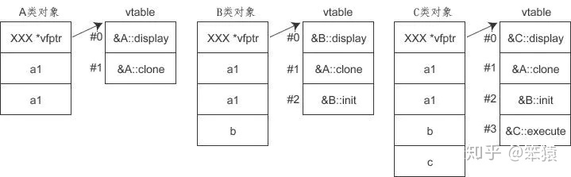

### C++的虚函数表与虚表指针
参考链接：
* <https://zhuanlan.zhihu.com/p/216258189>
* <https://zhuanlan.zhihu.com/p/75172640>
* <https://cloud.tencent.com/developer/article/1510207>
* <https://www.jianshu.com/p/7a7d22393277>

C++和Java的类都类似于C的struct，要实现能通过struct调用函数，只需要在struct里放函数指针，然后malloc那个struct再初始化就行。但是仅仅这样达不到动态绑定的功能，C++具体实现上是通过虚函数表和虚表指针：

C++若一个类中有虚函数，则这个类会有一个虚函数表（同一个类有多个实例只需要一份虚函数表就行），虚函数表是一个函数指针数组，记录了实际函数的地址，每个C++的类中有一个隐藏的虚表指针vptr，指向虚表。

[这个](https://zhuanlan.zhihu.com/p/216258189)链接中总结的：
1. 类的内存占用由成员变量和指向虚函数表的指针组成，同时派生类的成员变量是会把基类的成员变量都继承的
2. 同名虚函数在基类和派生类中的虚函数表中，索引是一致的，如下图，A,B,C的display的索引都是0
3. 派生类中，一旦对基类中的虚函数进行了覆盖，那么派生类的虚函数表中响应函数的入口地址会被替换成覆盖后的函数的地址。
4. 一旦有新的虚函数定义，会加入到当前虚函数表的末端。



也就是说，通过虚函数表能查找到对象的实际类型的最新虚函数实现（如果没有进行重写的话则仍是父类中的函数实现）。

[这个](https://zhuanlan.zhihu.com/p/75172640)链接里的描述也比较清楚：


<div style="text-align: center">(非虚函数的调用不用经过虚表，故不需要虚表中的指针指向这些函数)</div>

### 动态绑定原理
以如下代码为例：
```C++
GeometricObject *p = new Circle();
p->vfunc1(); 
```
circle创建时，其中的**vptr指向的是Circle的虚函数表**（转为GeometricObject *不会影响到vptr，只是编译时符号表中p的类型信息是GeometricObject *），当调用p->vfunc1()时，编译器能查找到虚表中vfunc1()的index，从而可以找到对应的函数指针，编译器会将p->vfunc1()进行转换，从而可以调用到Circle::vfunc1(p)。

参考<https://zhuanlan.zhihu.com/p/216258189>:

---

假定指针p调用虚函数display(), 发生调用时：

1. 首先会找到函数的索引，这里display索引是0
2. 然后编译器会做一个替换，（*(p->vptr)[0]），找到p指针的函数入口地址
3. 程序运行后会执行这条语句，完成函数的调用，这就是动态绑定。

对于不同的虚函数，仅仅就是索引的不同。

---

参考<https://zhuanlan.zhihu.com/p/75172640>:

---
p->vfunc1()可以用以下表达式来表示：
```
(*(p->__vptr)[n])(p)
```
可以看到，通过使用这些虚函数表，即使使用的是基类的指针来调用函数，也可以达到正确调用运行中实际对象的虚函数。

我们把经过虚表调用虚函数的过程称为动态绑定，其表现出来的现象称为运行时多态。动态绑定区别于传统的函数调用，传统的函数调用我们称之为静态绑定，即函数的调用在编译阶段就可以确定下来了。

那么，什么时候会执行函数的动态绑定？这需要符合以下三个条件。

* 通过指针来调用函数
* 指针upcast向上转型
* 调用的是虚函数

如果一个函数调用符合以上三个条件，编译器就会把该函数调用编译成动态绑定，其函数的调用过程走的是上述通过虚表的机制。

---

### 关于this
首先，Java中引用类型的概念底层就是C/C++的指针的概念，只是Java的引用类型会自动解引用，即：Java中`list.toString()`相当于C++中`list->toString()`或者`(*list).toString()`，不知道是通过C++的操作符重载还是Java编译器自己转换之类的方式实现的。总之效果就是不用像C++一样通过指针调用函数时要用->或者先用*解引用。此外，C++和Java在调用实例方法时，应该都会隐式地传递进去调用者的地址（那个参数的形参名为this），从而实例方法中才能直接用this指针。例如Java中object.getName()相当于调用object.getName(object)，而object传入之后的形参名为this。而对于静态方法，不会隐式地传入this，因此静态方法中没有this指针。

没找到官方文档，不过这样理解应该是正确的，有一些链接可以佐证：
1. <https://www.cnblogs.com/yougewe/p/9929249.html>
2. <https://blog.csdn.net/weixin_43222324/article/details/108563819>，部分原文："`p->fun0();`这种成员函数调用，在编译器里面会转变成`A::fun0(this);`，this指针会当作一个参数传给函数的。"
3. 上面[这个](https://zhuanlan.zhihu.com/p/75172640)链接中作者总结的这个表达式`(*(p->__vptr)[n])(p)`也可以佐证这一点。

### Java的实例方法与虚函数的关系
参考
* <https://blog.csdn.net/weixin_39688019/article/details/114742930>
* <https://zh.wikipedia.org/wiki/%E8%99%9A%E5%87%BD%E6%95%B0#Java>
* <https://www.runoob.com/java/java-polymorphism.html>

Java的实例方法都是虚函数，除了final/private方法，final/private标记的方法是非虚函数应该是因为子类不可能重写了，所以Java直接没通过虚函数表来进行调用。

此外，静态方法和构造方法不是虚函数。

### 类的内存布局
参考：
* <https://www.zhihu.com/tardis/zm/art/380147337?source_id=1003>
* <https://blog.csdn.net/dxpqxb/article/details/102794132>

一个类的实例，按C来理解，相当于C里的struct，包含vptr和成员变量，new的时候相当于C里malloc这个struct再初始化。关于非虚函数，可以在这个struct里放函数指针进行调用。不过看参考链接，实际没有在struct里放函数指针，也就是说例如:
```
Circle *c = new Circle();
c->toString();
```
这里找toString函数的地址不是通过c里面有函数指针，而是编译器知道函数的入口地址，然后直接把c->toString();调用成Circle::toString(c);(代码里直接这样写不行，这是调用静态方法的写法)

存在继承关系时，类的实例的内存区域有父类的东西，也有子类的东西。编译器处理引用属性和调用函数的代码时需要做的是找到对象基地址+属性地址偏移量(对于实例属性，静态属性应该是放在.data或.bss段)或者入口地址(对于函数)。