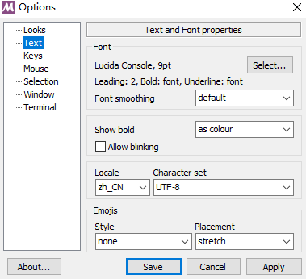

### git中文乱码问题解决

---

### linux下

参考链接：

https://www.jianshu.com/p/fc8162ed1e3d

操作方式：

1.运行:

```
$ git config --global core.quotepath false          # 显示 status 编码
$ git config --global gui.encoding utf-8            # 图形界面编码
$ git config --global i18n.commit.encoding utf-8    # 提交信息编码
$ git config --global i18n.logoutputencoding utf-8  # 输出 log 编码
```

2.设置LESSCHARSET环境变量:

`vim ~/.bashrc`，添加export LESSCHARSET=utf-8

这一条按参考链接的说法是因为 git log 默认使用 less 分页，所以需要 bash 对 less 命令进行 utf-8 编码

---

### windows下

参考链接：

https://zhuanlan.zhihu.com/p/133706032

1.`git bash`终端输入命令：

```text
git config --global core.quotepath false
```

2.`git bash`终端设置成中文和`utf-8`编码

在git bash的窗口顶部鼠标右键，选择Options，选Text，Locale改为zh_CN，Character set改为UTF-8



这样两步之后重启一下应该就可以了，实测git版本2.34.1和2.36.1设置之后在git bash下中文显示没有再乱码(cmd和powershell下稍微试了下似乎也是ok的，不过没有细致地测试)。但git版本2.28.0下仍然乱码(https://blog.csdn.net/qq_33154343/article/details/109567337 里也是说2.28.0不行)。实际使用时安装较新版本git就行。

参考链接里还给了类似Linux下的设置方法，不过上面两步之后实测已经没有中文乱码问题，这种方式没有测试，应该用不上。原文为：

---

**通过修改配置文件来解决中文乱码**

如果你的git bash终端没有菜单选项显示，还可以通过直接修改配置文件的方式来解决中文乱码问题。

进入git的安装目录

编辑`etc\gitconfig`文件，也有些windows系统是存放在`C:\Users\Administrator\.gitconfig`路径或`安装盘符:\Git\mingw64\etc\gitconfig`，在文件末尾增加以下内容：

```text
[gui]
    encoding = utf-8
    # 代码库统一使用utf-8
[i18n]
    commitencoding = utf-8
    # log编码
[svn]
    pathnameencoding = utf-8
    # 支持中文路径
[core]
    quotepath = false
    # status引用路径不再是八进制（反过来说就是允许显示中文了）
```

编辑`etc\git-completion.bash`文件,在文件末尾增加以下内容：

```text
# 让ls命令能够正常显示中文
alias ls='ls --show-control-chars --color=auto'
```

编辑`etc\inputrc`文件，修改`output-meta`和`convert-meta`属性值：

```text
set output-meta on  # bash可以正常输入中文
set convert-meta off
```

编辑`profile`文件，在文件末尾添加如下内容：

```text
export LESSHARESET=utf-8
```

---
