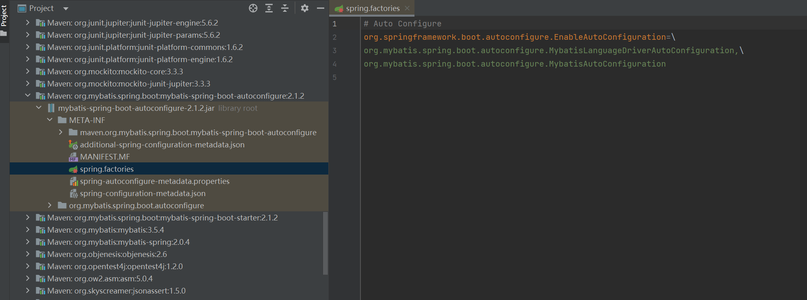
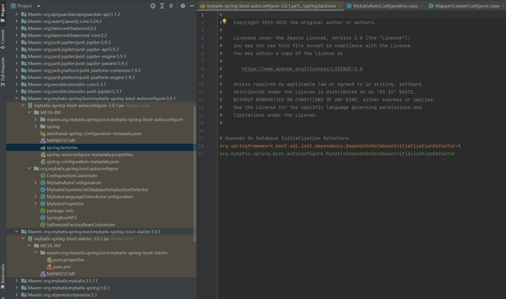
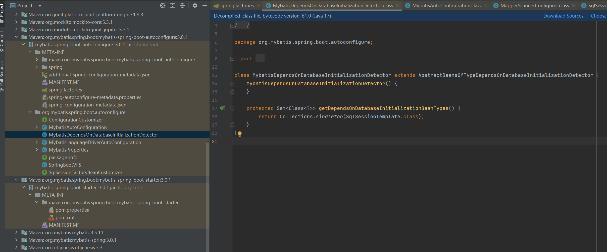

## 在springboot启动过程中，mybatis是如何被整合到框架中的，mybatis的代码是如何获得执行机会的？
参考:
* [Mybatis是如何在SpringBoot中被加载执行的？](https://zhuanlan.zhihu.com/p/510876738)
* [为啥mybatis的mapper只有接口没有实现类，但它却能工作？](https://blog.csdn.net/l18848956739/article/details/102793211)
* [关于 MyBatis 是如何被集成进 Spring 的](https://juejin.cn/post/7004390222934999076)
* [动态注册bean，Spring官方套路：使用ImportBeanDefinitionRegistrar](https://zhuanlan.zhihu.com/p/30123517)
* [Spring中BeanDefinitionRegistryPostProcessor接口 -【Spring底层原理】](https://juejin.cn/post/6943025527619846152)

参考[这个](https://juejin.cn/post/7004390222934999076)，不与springboot框架整合的独立的mybatis使用起来是像下面这样:
```Java
// 1、
String resource = "mybatis-config.xml";
InputStream inputStream = Resources.getResourceAsStream(resource);
SqlSessionFactory factory = new SqlSessionFactoryBuilder().build(inputStream);

// 2、
SqlSession sqlSession = factory.openSession();

// 3、
XxxMapper mapper = sqlSession.getMapper(XxxMapper.class);
XxxPo po = mapper.getBy(2);

// 4、
sqlSession.close();
```
要整合进springboot的话，要有个SqlSessionFactory，此外，使用springboot时只写了mapper接口，mybatis要根据mapper接口和相应的sql操作信息，生成实际的mapper实现，然后代码中就可以利用依赖注入获取到实际可用的mapper实现。

参考[这个](https://zhuanlan.zhihu.com/p/510876738):

> springboot启动的时候会读取META-INF\spring.factories文件，把key=org.springframework.boot.autoconfigure.EnableAutoConfiguration的字符串作为类名去加载(启动会配合META-INF\spring-autoconfigure-metadata.properties中的内容过滤掉不符合当前场景的)springboot集成mybatis也是这样实现的。

查看整合了mybatis-spring-boot-starter 2.1.2的springboot项目的依赖项:



但是对于mybatis-spring-boot-starter 3.0.1，实际查看是这样的：



查看那个MybatisDependsOnDatabaseInitializationDetector:



不知道这种又是如何加载的，参考链接中也是mybatis-spring-boot-starter 2的内容，以下按2的来说。

通过spring.factories这个文件，mybatis使得springboot会去加载MybatisAutoConfiguration这个类，从而mybatis的代码得到了执行机会。

查看MybatisAutoConfiguration这个类的内容，首先是有个sqlSessionFactory()方法:

```Java
@Bean
@ConditionalOnMissingBean
public SqlSessionFactory sqlSessionFactory(DataSource dataSource) throws Exception {
    SqlSessionFactoryBean factory = new SqlSessionFactoryBean();
    factory.setDataSource(dataSource);
    if (this.properties.getConfiguration() == null || this.properties.getConfiguration().getVfsImpl() == null) {
        factory.setVfs(SpringBootVFS.class);
    }

    if (StringUtils.hasText(this.properties.getConfigLocation())) {
        factory.setConfigLocation(this.resourceLoader.getResource(this.properties.getConfigLocation()));
    }
    ...

    this.applySqlSessionFactoryBeanCustomizers(factory);
    return factory.getObject();
}
```

这个方法被@Bean注解，从而这样就能注册一个SqlSessionFactory对象到IOC容器中。

还有个sqlSessionTemplate的注入，应该也是mybatis初始化需要的:

```Java
@Bean
@ConditionalOnMissingBean
public SqlSessionTemplate sqlSessionTemplate(SqlSessionFactory sqlSessionFactory) {
    ExecutorType executorType = this.properties.getExecutorType();
    return executorType != null ? new SqlSessionTemplate(sqlSessionFactory, executorType) : new SqlSessionTemplate(sqlSessionFactory);
}
```

然后关于读取mapper接口和mapper xml生成实际的实现，最终mybatis生成mapper接口的实现的方式是Java的动态代理机制，可以动态生成接口的实例，然后mybatis将其注入到IOC容器，然后代码中就可以利用依赖注入获取到实际可用的mapper实现:

MybatisAutoConfiguration类中定义了一个内部类，按[参考链接](https://zhuanlan.zhihu.com/p/510876738)所说，由于AutoConfiguredMapperScannerRegistrar实现了ImportBeanDefinitionRegistrar接口，在加载的过程中，Spring会调用registerBeanDefinitions去注册额外的bean的定义
```Java
public static class AutoConfiguredMapperScannerRegistrar implements BeanFactoryAware, EnvironmentAware, ImportBeanDefinitionRegistrar {
    private BeanFactory beanFactory;
    private Environment environment;

    public AutoConfiguredMapperScannerRegistrar() {
    }

    public void registerBeanDefinitions(AnnotationMetadata importingClassMetadata, BeanDefinitionRegistry registry) {
        if (!AutoConfigurationPackages.has(this.beanFactory)) {
            MybatisAutoConfiguration.logger.debug("Could not determine auto-configuration package, automatic mapper scanning disabled.");
        } else {
            ...
            builder.setRole(2);
            registry.registerBeanDefinition(MapperScannerConfigurer.class.getName(), builder.getBeanDefinition());
        }
    }
    ...
```
最后有一行`registry.registerBeanDefinition(MapperScannerConfigurer.class.getName(), builder.getBeanDefinition());`按[参考链接](https://zhuanlan.zhihu.com/p/510876738)所说，
由于MapperScannerConfigurer这个类实现了BeanDefinitionRegistryPostProcessor，所以它就会被生成bean之前加载，调用它的postProcessBeanDefinitionRegistry方法
```Java
public void postProcessBeanDefinitionRegistry(BeanDefinitionRegistry registry) {
    if (this.processPropertyPlaceHolders) {
        this.processPropertyPlaceHolders();
    }

    ClassPathMapperScanner scanner = new ClassPathMapperScanner(registry);
    scanner.setAddToConfig(this.addToConfig);
    scanner.setAnnotationClass(this.annotationClass);
    scanner.setMarkerInterface(this.markerInterface);
    scanner.setSqlSessionFactory(this.sqlSessionFactory);
    scanner.setSqlSessionTemplate(this.sqlSessionTemplate);
    scanner.setSqlSessionFactoryBeanName(this.sqlSessionFactoryBeanName);
    scanner.setSqlSessionTemplateBeanName(this.sqlSessionTemplateBeanName);
    scanner.setResourceLoader(this.applicationContext);
    scanner.setBeanNameGenerator(this.nameGenerator);
    scanner.setMapperFactoryBeanClass(this.mapperFactoryBeanClass);
    if (StringUtils.hasText(this.lazyInitialization)) {
        scanner.setLazyInitialization(Boolean.valueOf(this.lazyInitialization));
    }

    if (StringUtils.hasText(this.defaultScope)) {
        scanner.setDefaultScope(this.defaultScope);
    }

    scanner.registerFilters();
    scanner.scan(StringUtils.tokenizeToStringArray(this.basePackage, ",; \t\n"));
}
```
`scanner.scan(StringUtils.tokenizeToStringArray(this.basePackage, ",; \t\n"));`会到ClassPathBeanDefinitionScanner的scan方法:
```Java
public int scan(String... basePackages) {
    int beanCountAtScanStart = this.registry.getBeanDefinitionCount();
    this.doScan(basePackages);
    if (this.includeAnnotationConfig) {
        AnnotationConfigUtils.registerAnnotationConfigProcessors(this.registry);
    }

    return this.registry.getBeanDefinitionCount() - beanCountAtScanStart;
}
```
然后到doScan方法:
```Java
protected Set<BeanDefinitionHolder> doScan(String... basePackages) {
    Assert.notEmpty(basePackages, "At least one base package must be specified");
    Set<BeanDefinitionHolder> beanDefinitions = new LinkedHashSet();
    String[] var3 = basePackages;
    int var4 = basePackages.length;

    for(int var5 = 0; var5 < var4; ++var5) {
        String basePackage = var3[var5];
        Set<BeanDefinition> candidates = this.findCandidateComponents(basePackage);
        Iterator var8 = candidates.iterator();

        while(var8.hasNext()) {
            BeanDefinition candidate = (BeanDefinition)var8.next();
            ScopeMetadata scopeMetadata = this.scopeMetadataResolver.resolveScopeMetadata(candidate);
            candidate.setScope(scopeMetadata.getScopeName());
            String beanName = this.beanNameGenerator.generateBeanName(candidate, this.registry);
            if (candidate instanceof AbstractBeanDefinition abstractBeanDefinition) {
                this.postProcessBeanDefinition(abstractBeanDefinition, beanName);
            }

            if (candidate instanceof AnnotatedBeanDefinition annotatedBeanDefinition) {
                AnnotationConfigUtils.processCommonDefinitionAnnotations(annotatedBeanDefinition);
            }

            if (this.checkCandidate(beanName, candidate)) {
                BeanDefinitionHolder definitionHolder = new BeanDefinitionHolder(candidate, beanName);
                definitionHolder = AnnotationConfigUtils.applyScopedProxyMode(scopeMetadata, definitionHolder, this.registry);
                beanDefinitions.add(definitionHolder);
                this.registerBeanDefinition(definitionHolder, this.registry);
            }
        }
    }

    return beanDefinitions;
}
```
这个doScan()里有findCandidateComponents()和对candidates的迭代，应该这里就是扫描类路径下的mapper注解类，然后注册Bean定义。

然后再按[参考链接](https://zhuanlan.zhihu.com/p/510876738)中所说的:

创建bean对象实例会调用到AbstractBeanFactory的doGetBean这个方法(看这个意思Spring注册bean的定义是一个阶段，生成实际的bean是分开的后面一个阶段)，doGetBean的这行代码`beanInstance = getObjectForBeanInstance(sharedInstance, name, beanName, mbd);`最终会调用到FactoryBeanRegistrySupport的doGetObjectFromFactoryBean方法，返回真正的userMapper的bean对象，也就是调用MapperFactoryBean的getObject()方法。

这个MapperFactoryBean的getObject()方法走几步之后就能看到最终会调用到MapperRegistry的getMapper方法:
```Java
public <T> T getMapper(Class<T> type, SqlSession sqlSession) {
    MapperProxyFactory<T> mapperProxyFactory = (MapperProxyFactory)this.knownMappers.get(type);
    if (mapperProxyFactory == null) {
        throw new BindingException("Type " + type + " is not known to the MapperRegistry.");
    } else {
        try {
            return mapperProxyFactory.newInstance(sqlSession);
        } catch (Exception var5) {
            throw new BindingException("Error getting mapper instance. Cause: " + var5, var5);
        }
    }
}
```
这里`mapperProxyFactory.newInstance(sqlSession);`应该就是动态代理生成mapper对象。

## 总结
还是很迷，不过大概知道了一点mybatis整合进springboot的原理。