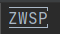

### markdown的行首缩进

​	markdown在行首直接敲空格或者tab，要么变代码块（1个tab或4个空格），要么没效果（例如1个空格，不过也看具体的预览工具，

像typora行首敲一个空格预览里会有缩进，vscode和github的预览里就完全没效果）。要在行首有缩进，可以使用`&nbsp;`。

​	用typora编写markdown时可以直接用tab进行行首缩进的原因是，在非源代码模式下，当你在行首按tab时，typora会在那行前面额外加一个特殊字符，然后才是tab。这个特殊字符为`&#8203;`，叫做零宽空格（zero-width space, ZWSP）是一种不可打印的Unicode字符。这个字符在typora的源代码模式和github的编辑模式里显示为一个红点 ，在vscode和notepad++里完全不显示，在idea里显示为 。此外，typora里如果这个红点在第一行行头，每次打开文件的时候发现typora会把这个红点去掉，所以要加个标题。

