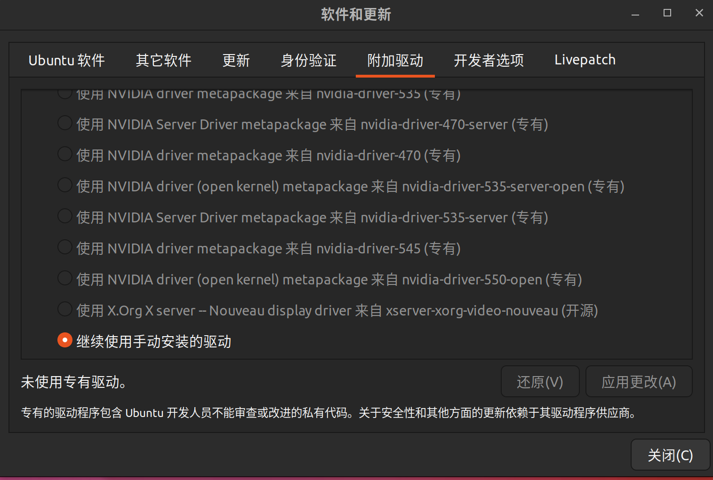

2024/12/31，重装了ubuntu，补充问题以及解决方式。

### 无法调节屏幕亮度问题(快捷键或界面上拉动亮度滑块都无效，始终保持在最大亮度)
尝试切换电脑的集显和独显模式，或者在ubuntu的"附加驱动"工具里，切换显卡驱动

### 开机提示DPC: rp pio log size 0 is invalid，并卡死无法进入ubuntu
切换集显和独显模式可以进入系统(我是从独显切换到集显后可以进系统了，但是用集显屏幕亮度又不可调)

参考:

* https://blog.csdn.net/qq_45401419/article/details/125578145

* https://blog.csdn.net/weixin_43579212/article/details/118581746

* https://blog.csdn.net/weixin_44169087/article/details/137455044

* https://blog.csdn.net/qq_49323609/article/details/130310522

修改grub启动文件:

`sudo gedit /etc/default/grub`

将其中的:

`GRUB_CMDLINE_LINUX_DEFAULT="quiet splash"`

改成:

`GRUB_CMDLINE_LINUX_DEFAULT=“quiet splash nouveau.modeset=0"`

然后更新内核引导文件:

`sudo update-grub`

大概逻辑应该是: nouveau是社区提供的针对Nvidia显卡的驱动程序，很多linux发行版默认集成了nouveau驱动，与Nvidia官方的显卡驱动程序可能有冲突，所以要用nouveau.modeset=0禁用nouveau。

这个方法对我生效了，可能如果不显式禁用nouveau，即便选择使用Nvidia官方的驱动，nouveau也会有部分运行，进而与Nvidia官方驱动产生冲突？

补充: 如果还是有问题，尝试

`sudo vim /etc/modprobe.d/blacklist.conf`

并在blacklist.conf文件中最后添加如下内容

```
blacklist nouveau
options nouveau modeset=0
```
似乎grub设置nouveau.modeset=0，仅禁用modeset功能，不阻止模块加载，而修改blacklist.conf是完全地禁用nouveau。

**注意**: 我这次安装ubuntu时，在ubuntu的安装界面勾选上了

```
√ 为图形或无线硬件，以及其它媒体格式安装第三方软件
   此软件及其文档遵循许可条款，其中一些是专有的。
```

这个选项，所以一开始应该就直接安装并使用了Nvidia官方的专有驱动，我在集显模式下屏幕亮度不可调，独显模式下屏幕亮度可调。但独显模式下开机又进不去ubuntu，把nouveau禁用后是正常的(独显模式，能调节屏幕亮度，开机能进入ubuntu)。

如果安装时没有勾选这个选项，应该是会用nouveau，但是此时没有安装并使用Nvidia官方驱动，直接把nouveau禁用可能会黑屏，应该要先在"附加驱动"里选择好Nvidia官方的驱动。

此外，由于勾选了这个选项，所以我点开"附加驱动"后界面是这样的:



提示我在使用手动安装的驱动，其它几个是点不了的，应该是因为驱动是在安装ubuntu过程中安装的，而不是通过ubuntu默认的软件包管理器安装(例如apt)，所以不让我通过"附加驱动"进行更改。

### 更新Nvidia官方驱动版本
`nvidia-smi`查看当前的驱动版本

然后`ubuntu-drivers devices`检查可用的Nvidia驱动

然后`sudo apt install nvidia-driver-550`

更新驱动版本之后发现即使是集显模式也能调节屏幕亮度了。此外由于使用了apt更新驱动，"附加驱动"也不再显示在使用手动安装的驱动了，前面的各个条目不再是灰的。

### 依然存在的问题
1. ubuntu关机较慢

2. 开机进ubuntu时仍会提示DPC: rp pio log size 0 is invalid，但是不会卡死，能进系统

3. 如果刚进ubuntu就迅速重启，会提示DPC: rp pio log size 0 is invalid并卡死
