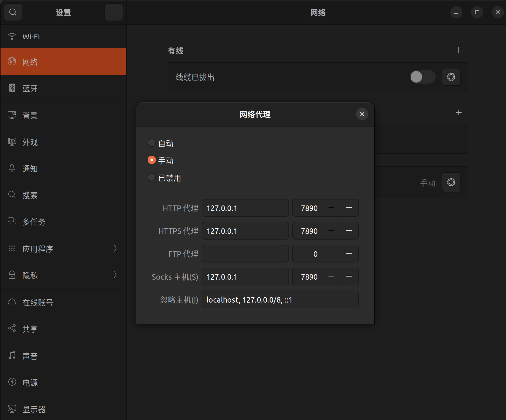
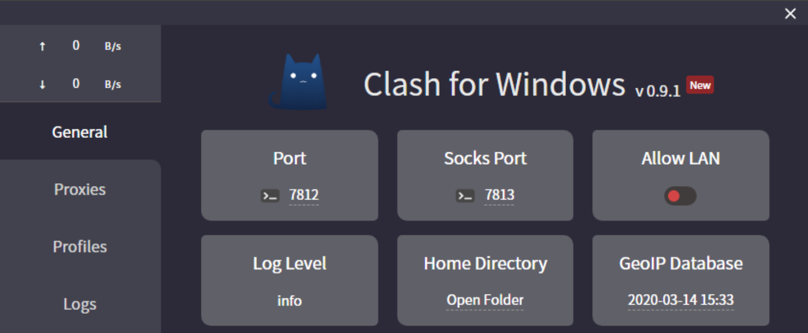
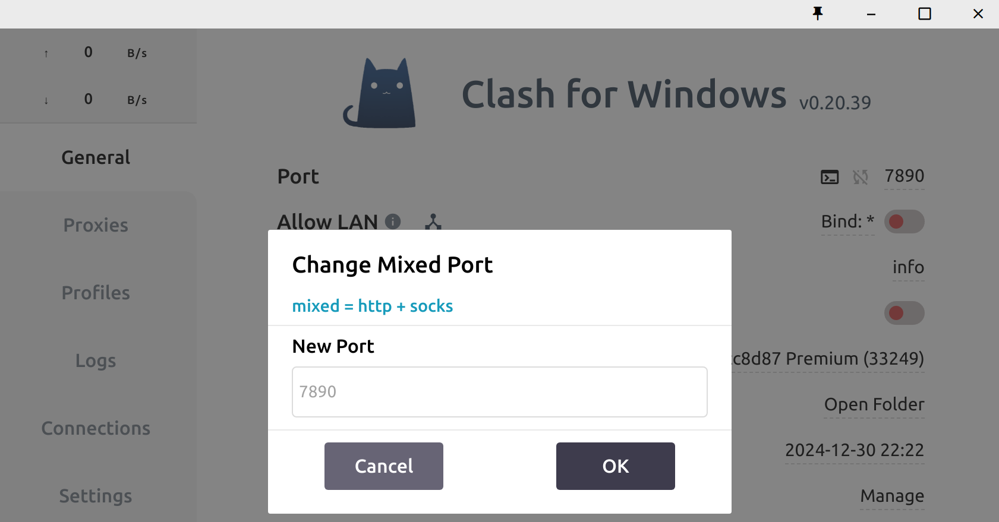
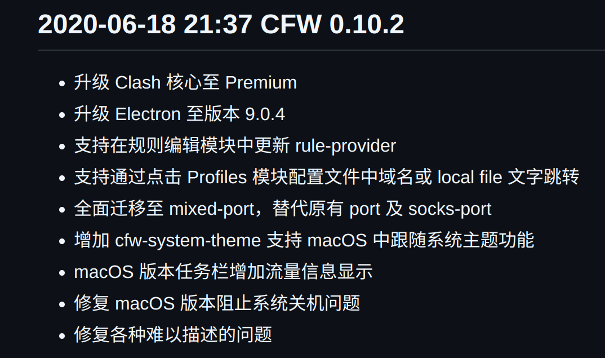
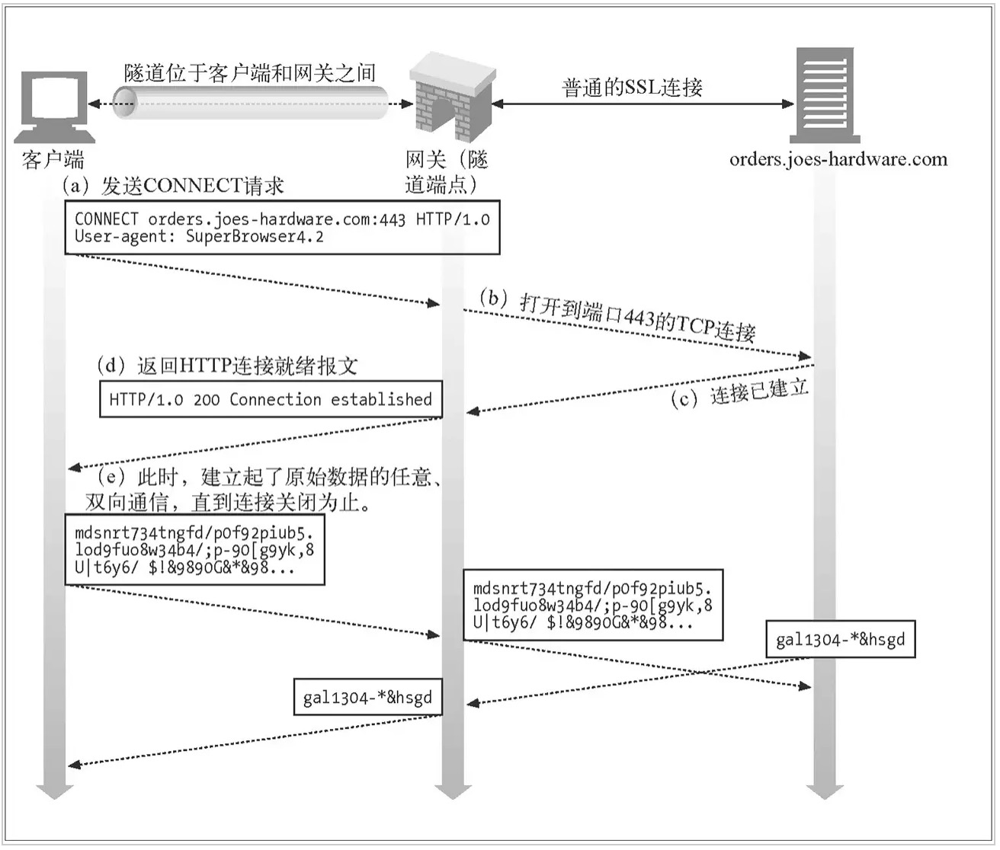

安装好ubuntu后，记得在终端和桌面环境都设置代理环境变量，具体来说(以开着clash for windows为例)：

### 桌面环境
设置 -> 网络 -> 网络代理 -> 手动:



这里对cfw来说这个socks主机的端口号应该也是7890，以前看到的教程这里填7891，可能早期的cfw是把http代理和socks代理分开在两个端口的，

[这个链接](https://www.codein.icu/clashtutorial/)里有张图能看到早期cfw分开端口:



但是后面应该就是一个端口同时支持http/socks5协议了(应该是用头部的数据内容格式检测的):



找到[这个](https://gist.github.com/gledos/8037a96c28f6cdea4e5823f05feca56b)仓库有cfw的更新日志，也能看到合并port的记录:



以前没关注过这个socks，这次试了下，

`curl -x socks5h://127.0.0.1:7890 https://www.google.com`

是能返回内容的(根据chatgpt的回答，这里 socks5h 的 h 表示域名解析由代理服务器来处理而 socks5 DNS解析由客户端进行，试了下改成socks5://请求会失败，应该是因为DNS污染)，而

`curl -x socks5h://127.0.0.1:7891 https://www.google.com`

报错 curl: (7) Failed to connect to 127.0.0.1 port 7891 after 0 ms: Connection refused，所以可以佐证cfw socks代理也在7890端口上。

### 终端环境
`vim ~/.bashrc`，添加上
```
export HTTP_PROXY="http://127.0.0.1:7890"
export HTTPS_PROXY="http://127.0.0.1:7890"
```

关于代理环境变量的作用以及为什么要在两个地方写代理环境变量以及环境变量的继承，之前在<https://github.com/plerks/Xray-deployment>里有写。

这篇文章[命令行设置代理原理详解](https://www.cnblogs.com/kasuganokusa/p/15839205.html)也有说明。

此外，关于为什么`export HTTPS_PROXY="http://127.0.0.1:7890"`右边是`http:`而不是`https:`，结合chatgpt的回答和[命令行设置代理原理详解](https://www.cnblogs.com/kasuganokusa/p/15839205.html)的内容，大概应该是：代理服务器通过HTTP CONNECT方法，建立一个到目标服务器(例如google)的TCP隧道，即便用户做的是HTTPS请求，代理程序是通过HTTP CONNECT方法，直接将数据转发，不解密HTTPS流量。所以，无论用户是HTTP还是HTTPS请求，代理程序都是以HTTP的方式工作充当中转的，不解析数据内容(应该是相当于代理程序以HTTP的方式充当路由器转发)。

如果代理程序使用的是socks5而不是http，应该就得`export HTTPS_PROXY="socks5://127.0.0.1:7890"`这样。

## 具体来说，代理是如何实现的？
参考:
* https://lilywei739.github.io/2017/01/25/principle_for_http_https.html

* https://developer.mozilla.org/zh-CN/docs/Web/HTTP/Methods/CONNECT

* https://github.com/wuchangming/https-mitm-proxy-handbook/blob/master/doc/Chapter2.md

问题有4个对象，客户端(支持代理，会探测代理环境的web client，例如浏览器)，  客户端代理程序，  服务器端代理程序，  服务器端，以下分别用C1  C2  S1  S2来代表。

### 代理http请求
容易实现，http是明文，所以C1探测到http.proxy环境变量后，改变行为，不去自行解析DNS，而是直接与C2建立连接并把请求内容发到C2，并且，C1给C2的http请求头中有完整的url，此外，根据C2的配置文件，其知道S1的地址，于是C2将http报文传递给S1，S1根据报文中的url，知道要请求的S2是谁，于是，S1与S2建立连接并向其发送传递过来的http报文。接下来C1  C2  S1  S2都只需要对各自的socket fd读写即可。

### 代理https请求
代理https不能像http那样做，当C1与C2建立连接后，按正常的https请求这时候C1是要服务器端给证书过来的，但是C2给不出来证书！

所以，C1同样需要改变自己的行为，C1探测到https.proxy环境变量后，改变行为，不去自行解析DNS，而是直接与C2建立连接。但是，此时C1不能像普通的https请求一样等待证书过来，而是要先进行HTTP CONNECT，参考[这个](https://developer.mozilla.org/zh-CN/docs/Web/HTTP/Methods/CONNECT)，HTTP CONNECT的内容类似:

```
CONNECT www.example.com:443 HTTP/1.1
```
注意里面指出了S2是谁，于是，C2拿着这个CONNECT请求向S1发，S1拿到这个请求去与S2建立连接，此时，各个fd同样就准备好了，C2和S1就可以像隧道一般工作了，C1和S2之间通过隧道达成了双向通信，于是，C1只需像普通https一样开始向S2发送ClientHello即可开始一切。

[这个](https://lilywei739.github.io/2017/01/25/principle_for_http_https.html)链接里的图很清晰(不过图里面隧道位于客户端和网关之间和我的理解有偏差，我觉得是C2和S1共同将中间封装成了隧道):



[这个](https://github.com/wuchangming/https-mitm-proxy-handbook/blob/master/doc/Chapter2.md)仓库也讲得很清楚，且有示例代码。

整个过程中，只有C1和S2在进行TLS加/解密，效率上不会有太大下降，且C2和S1是以隧道方式工作的，代理程序并不知道加密的内容是什么，这种http隧道实现https代理，没有数据安全风险。