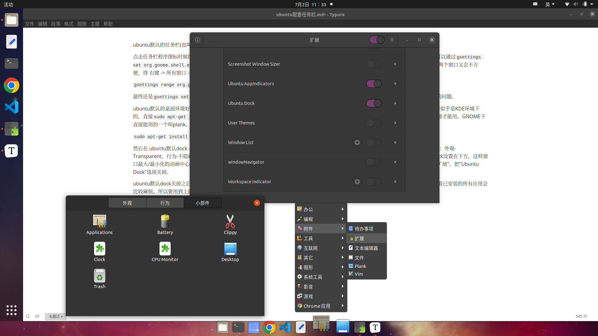

ubuntu默认的任务栏(也叫做程序坞、dock)不是很方便。程序只开了一个窗口倒没什么，但是出现例如VSCode开了多个窗口就不太方便。

点击任务栏程序图标时候的行为默认是'focus-or-previews'，这时左键点击任务栏图标出现预览窗口，但是最小化时得自己点窗口右上角。可以通过`gsettings set org.gnome.shell.extensions.dash-to-dock click-action 'minimize'`设置成点击行为是最大/最小化窗口，但是切换VSCode的两个窗口又会不方便，得 右键 -> 所有窗口 -> 再点击对应窗口。

`gsettings range org.gnome.shell.extensions.dash-to-dock click-action`查看所有可选项也没别的好的选择，

最终还是`gsettings set org.gnome.shell.extensions.dash-to-dock click-action 'minimize'`比较好，然后再解决切换同一程序的多个窗口的问题。

ubuntu默认的桌面环境好像是GNOME，除此之外还有个叫KDE的桌面环境比较流行，有个插件叫latte-dock可以定制任务栏，但是这个插件似乎是KDE环境下的，直接`sudo apt-get install latte-dock`会把KDE Plasma(KDE的最小安装版)作为间接依赖装进来，所以大概是要先切到KDE桌面环境才能用。GNOME下直接能用的一个叫plank。

`sudo apt-get install plank`

然后在 ubuntu默认dock -> 显示应用程序 里找到plank并启动，下方就会出现plank的dock。程序坞上ctrl + 右键 -> 首选项配置plank，例如：外观-Transparent，行为-不隐藏dock，小部件-加上Applications(列出所有已安装应用)和Desktop(点击回到桌面,也可以用windows键+d)。此外还需要把ubuntu默认的dock不显示(先在 设置 -> 外观 里把dock设置在下方，这样窗口最大/最小化的动画中心在下方)，先`sudo apt install gnome-shell-extensions`，然后在 ubuntu默认dock -> 显示应用程序 里找到"扩展"，把"Ubuntu Dock"选项关掉。

ubuntu默认dock关掉之后，由于没有了默认dock里的显示所有应用程序的按键，想直接找到gnome-shell-extensions重新打开dock或者查看已安装的所有应用会比较麻烦。所以要用到上面提到的plank小部件里的Applications，这个里面也会列出所有安装了的应用。

### plank开机启动

上面这样做完之后，每次开机还需要命令行运行plank才能启动plank的dock。所以需要让plank开机启动：

`sudo ln -s /usr/share/applications/plank.desktop /etc/xdg/autostart/`

### 参考链接

* https://vimsky.com/article/4227.html
* https://www.jianshu.com/p/9b4f66a5b2f7
* https://bynss.com/linux/300103.html
* https://www.gnome-look.org/p/1722759
* https://www.linuxrumen.com/rmxx/1792.html
* http://c.biancheng.net/view/2912.html
* https://zhuanlan.zhihu.com/p/133301317
* https://askubuntu.com/questions/1030531/how-do-i-turn-off-minimize-on-click-option-for-ubuntu-dock
* https://www.cnblogs.com/sun-sun/p/6707338.html
* https://www.linuxcapable.com/zh-CN/%E5%A6%82%E4%BD%95%E5%9C%A8ubuntu-20-04%E4%B8%8A%E5%AE%89%E8%A3%85kde%E7%AD%89%E7%A6%BB%E5%AD%90%E6%A1%8C%E9%9D%A2%E7%8E%AF%E5%A2%83/
* https://linux.cn/article-14340-1.html