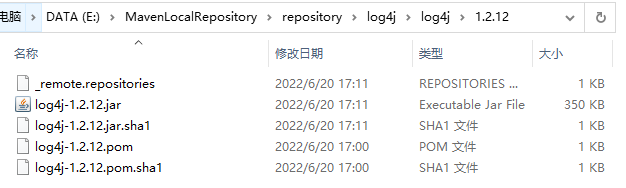
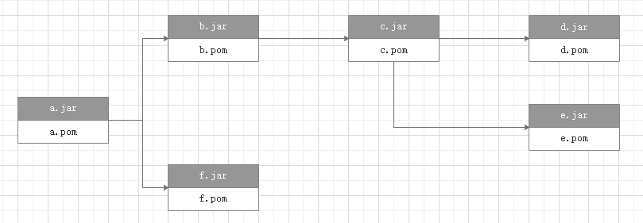

### Maven包管理机制

> 主要参考书籍《Maven实战》 ISBN-9787111321545

**Maven坐标**

Maven通过pom.xml来定义项目所要使用的包（依赖）。Maven定义了这样一组规则：任何一个构件（在Maven中，任何依赖、插件或者项目构建的输出，都可以称为构件），都可以用Maven坐标唯一标识，Maven坐标的元素包括groupId、artifactId、version、packaging、classifier。上述5个元素中，groupId、artifactId、version是必须的，packaging指定项目打包方式，是可选的（默认为jar），而classifier用来定义构建输出的附属构件，例如javadoc(项目的classifier不能直接定义，因为附属构件不是项目直接默认生成，而是由附加的插件帮助生成)(但是作为依赖引用的时候应该是要加上classifier的)。

在定义自己的项目时，可以通过pom中的<dependencies></dependencies>字段引入第三方依赖，例如：

```xml
<dependencies>
    <dependency>
      <groupId>com.oracle.database.jdbc</groupId>
      <artifactId>ojdbc11</artifactId>
      <version>${version.lib.ojdbc}</version>
    </dependency>
    <dependency>
      <groupId>com.oracle.database.jdbc</groupId>
      <artifactId>ojdbc8</artifactId>
      <version>${version.lib.ojdbc}</version>
    </dependency>
</dependencies>
```

**Maven传递依赖**

Maven在实际需要使用到依赖时会根据依赖坐标将依赖从Maven中央仓库先下载下来放在本机的本地仓库，然后用于构建、测试等操作。而第三方依赖也有自己的pom文件，里面也有它们自身需要的依赖，这些依赖就构成了项目的传递依赖。Maven会递归解析所有直接依赖和传递性依赖的pom，在编译、测试等过程中将依赖的本地仓库路径(本地仓库的存储路径结构与Maven坐标对应)加入到javac和java命令的classpath参数中。





**依赖范围**

Maven在编译主代码、运行测试和实际运行项目时需要的依赖会有所不同，需要多套classpath，所以Maven在声明依赖时有几种依赖范围：

* compile
* test
* provided
* runtime
* system
* import

依赖范围会影响classpath的内容，也会对传递性依赖的范围产生影响。最终会影响到在Maven的不同生命周期任务中某个依赖是否要使用。

**依赖调解**

依赖调解来自这样一个问题：两个直接依赖可能会通过依赖传递同时引入不同版本的某个依赖，例如：

<pre>  A
  ├── B
  │   └── C
  │       └── D 2.0
  └── E
      └── D 1.0</pre>

B、E两个依赖都引入了D，但两个D的版本不一致。Maven解析后的依赖中，不可能出现groupId和artifactId相同，但是version不同的两个依赖。Maven依赖调解的策略是**最短路径优先**，上图中A->E->D(1.0)路径中的D将会被解析使用。如果出现有两条相同长度的路径冲突，则第一声明者优先。([参考](https://maven.apache.org/guides/introduction/introduction-to-dependency-mechanism.html))

Maven似乎没有其它依赖调解策略，这个回答里直接说Maven的这个策略没有其它配置方式：

<https://stackoverflow.com/questions/34201120/maven-set-dependency-mediation-strategy-to-newest-rather-than-nearest>

采用最短路径优先策略的好处之一是：即使出现了冲突，Maven也能直接确定要选用哪个依赖(虽然上面的例子里选择D1.0可能导致C有错误)。第二个好处是：总是可以通过在项目pom中声明为直接依赖的方式确定依赖版本。以上面的例子来说，若要自己指定D的版本，只需在项目pom中将D声明为直接依赖。

<pre>  A
  ├── B
  │   └── C
  │       └── D 2.0
  ├── E
  │   └── D 1.0
  │
  └── D 2.0      </pre>

由于最短路径的策略，D2.0将会被解析使用。

**maven范围型依赖**

参考<https://maven.apache.org/pom.html#dependency-version-requirement-specification>，maven可以写范围型依赖，范围型依赖版本有强指定和弱指定，弱指定就按上面的最短路径来选择，强指定如果出现冲突，会构建失败。<https://maven.apache.org/pom.html#version-order-specification>有说明版本号写法如果不是语义化版本时，maven对版本号大小的比较方法。

**maven锁文件**

gradle有锁文件，但是maven没有。参考<https://www.jianshu.com/p/0ac63bdd03db>，[maven推荐的可重复构建做法](https://maven.apache.org/guides/mini/guide-reproducible-builds.html)是不要使用范围型版本，关于version-lock，maven社区认为不在讨论范围内，将其放在了[out of scope](https://cwiki.apache.org/confluence/pages/viewpage.action?pageId=74682318#Reproducible/VerifiableBuilds-Outofscope)。


Maven会自动解析所有项目的直接依赖和传递性依赖，并且根据规则正确判断每个依赖的范围，对于一些依赖冲突，也能进行调解，以确保任何一个构件只有唯一的版本在依赖中存在。在这些工作之后，最后得到的那些依赖被称为已解析依赖(Resolved Dependency)。

运行：

`mvn dependency:list`

可以查看当前项目的已解析依赖

运行：

`mvn dependency:tree`

可以查看当前项目的依赖树结构

例如：

```
[INFO] com.example:demo:jar:0.0.1-SNAPSHOT
[INFO] +- org.springframework.boot:spring-boot-starter:jar:2.5.6:compile
[INFO] |  +- org.springframework.boot:spring-boot:jar:2.5.6:compile
[INFO] |  |  \- org.springframework:spring-context:jar:5.3.12:compile
[INFO] |  +- org.springframework.boot:spring-boot-autoconfigure:jar:2.5.6:compile  
[INFO] |  +- org.springframework.boot:spring-boot-starter-logging:jar:2.5.6:compile
[INFO] |  |  +- ch.qos.logback:logback-classic:jar:1.2.6:compile
[INFO] |  |  |  \- ch.qos.logback:logback-core:jar:1.2.6:compile
[INFO] |  |  +- org.apache.logging.log4j:log4j-to-slf4j:jar:2.14.1:compile
[INFO] |  |  |  \- org.apache.logging.log4j:log4j-api:jar:2.14.1:compile
[INFO] |  |  \- org.slf4j:jul-to-slf4j:jar:1.7.32:compile
[INFO] |  +- jakarta.annotation:jakarta.annotation-api:jar:1.3.5:compile
[INFO] |  +- org.springframework:spring-core:jar:5.3.12:compile
[INFO] |  |  \- org.springframework:spring-jcl:jar:5.3.12:compile
[INFO] |  \- org.yaml:snakeyaml:jar:1.28:compile
[INFO] +- org.springframework.boot:spring-boot-starter-test:jar:2.5.6:test
[INFO] |  +- org.springframework.boot:spring-boot-test:jar:2.5.6:test
[INFO] |  +- org.springframework.boot:spring-boot-test-autoconfigure:jar:2.5.6:test
[INFO] |  +- com.jayway.jsonpath:json-path:jar:2.5.0:test
[INFO] |  |  +- net.minidev:json-smart:jar:2.4.7:test
[INFO] |  |  |  \- net.minidev:accessors-smart:jar:2.4.7:test
[INFO] |  |  |     \- org.ow2.asm:asm:jar:9.1:test
[INFO] |  |  \- org.slf4j:slf4j-api:jar:1.7.32:compile
[INFO] |  +- jakarta.xml.bind:jakarta.xml.bind-api:jar:2.3.3:test
[INFO] |  |  \- jakarta.activation:jakarta.activation-api:jar:1.2.2:test
[INFO] |  +- org.assertj:assertj-core:jar:3.19.0:test
[INFO] |  +- org.hamcrest:hamcrest:jar:2.2:test
[INFO] |  +- org.junit.jupiter:junit-jupiter:jar:5.7.2:test
[INFO] |  |  +- org.junit.jupiter:junit-jupiter-api:jar:5.7.2:test
[INFO] |  |  |  +- org.apiguardian:apiguardian-api:jar:1.1.0:test
[INFO] |  |  |  +- org.opentest4j:opentest4j:jar:1.2.0:test
[INFO] |  |  |  \- org.junit.platform:junit-platform-commons:jar:1.7.2:test        
[INFO] |  |  +- org.junit.jupiter:junit-jupiter-params:jar:5.7.2:test
[INFO] |  |  \- org.junit.jupiter:junit-jupiter-engine:jar:5.7.2:test
[INFO] |  |     \- org.junit.platform:junit-platform-engine:jar:1.7.2:test
[INFO] |  +- org.mockito:mockito-core:jar:3.9.0:test
[INFO] |  |  +- net.bytebuddy:byte-buddy:jar:1.10.22:test
[INFO] |  |  +- net.bytebuddy:byte-buddy-agent:jar:1.10.22:test
[INFO] |  |  \- org.objenesis:objenesis:jar:3.2:test
[INFO] |  +- org.mockito:mockito-junit-jupiter:jar:3.9.0:test
[INFO] |  +- org.skyscreamer:jsonassert:jar:1.5.0:test
[INFO] |  |  \- com.vaadin.external.google:android-json:jar:0.0.20131108.vaadin1:test
[INFO] |  +- org.springframework:spring-test:jar:5.3.12:test
[INFO] |  \- org.xmlunit:xmlunit-core:jar:2.8.3:test
[INFO] +- org.springframework.boot:spring-boot-starter-web:jar:2.5.6:compile
[INFO] |  +- org.springframework.boot:spring-boot-starter-json:jar:2.5.6:compile
[INFO] |  |  +- com.fasterxml.jackson.core:jackson-databind:jar:2.12.5:compile
[INFO] |  |  |  +- com.fasterxml.jackson.core:jackson-annotations:jar:2.12.5:compile
[INFO] |  |  |  \- com.fasterxml.jackson.core:jackson-core:jar:2.12.5:compile
[INFO] |  |  +- com.fasterxml.jackson.datatype:jackson-datatype-jdk8:jar:2.12.5:compile
[INFO] |  |  +- com.fasterxml.jackson.datatype:jackson-datatype-jsr310:jar:2.12.5:compile
[INFO] |  |  \- com.fasterxml.jackson.module:jackson-module-parameter-names:jar:2.12.5:compile
[INFO] |  +- org.springframework.boot:spring-boot-starter-tomcat:jar:2.5.6:compile
[INFO] |  |  +- org.apache.tomcat.embed:tomcat-embed-core:jar:9.0.54:compile
[INFO] |  |  +- org.apache.tomcat.embed:tomcat-embed-el:jar:9.0.54:compile
[INFO] |  |  \- org.apache.tomcat.embed:tomcat-embed-websocket:jar:9.0.54:compile
[INFO] |  +- org.springframework:spring-web:jar:5.3.12:compile
[INFO] |  |  \- org.springframework:spring-beans:jar:5.3.12:compile
[INFO] |  \- org.springframework:spring-webmvc:jar:5.3.12:compile
[INFO] |     +- org.springframework:spring-aop:jar:5.3.12:compile
[INFO] |     \- org.springframework:spring-expression:jar:5.3.12:compile
[INFO] +- org.springframework.boot:spring-boot-starter-thymeleaf:jar:2.5.6:compile
[INFO] |  +- org.thymeleaf:thymeleaf-spring5:jar:3.0.12.RELEASE:compile
[INFO] |  |  \- org.thymeleaf:thymeleaf:jar:3.0.12.RELEASE:compile
[INFO] |  |     +- org.attoparser:attoparser:jar:2.0.5.RELEASE:compile
[INFO] |  |     \- org.unbescape:unbescape:jar:1.1.6.RELEASE:compile
[INFO] |  \- org.thymeleaf.extras:thymeleaf-extras-java8time:jar:3.0.4.RELEASE:compile
[INFO] \- com.google.code.gson:gson:jar:2.8.6:compile
```

这里列出的是依赖调解过后的依赖树，没有找到列出包含omited dependency的mvn命令。[官网](https://maven.apache.org/plugins/maven-dependency-plugin/tree-mojo.html)有提到一个verbose参数，但是实测在Maven3中不支持这个参数，输出与`mvn dependency:tree`一样。

```
PS E:\IntelliJ IDEA WorkSpace\test-maven> mvn dependency:tree -Dverbose=true
[INFO] Scanning for projects...
[INFO] 
[INFO] --------------------------< com.example:demo >--------------------------
[INFO] Building demo 0.0.1-SNAPSHOT
[INFO] --------------------------------[ jar ]---------------------------------
[INFO] 
[INFO] --- maven-dependency-plugin:3.1.2:tree (default-cli) @ demo ---
[INFO] Verbose not supported since maven-dependency-plugin 3.0
```

`mvn dependency:tree `能指定其它[输出格式](https://maven.apache.org/plugins/maven-dependency-plugin/tree-mojo.html#outputtype)，默认的格式不方便机器读。dot和tgf比较适合机器读：

`mvn dependency:tree -DoutputType=dot`

### npm包管理

[npm官网](https://docs.npmjs.com/about-packages-and-modules)的定义下，包的概念为：

A package is any of the following:

- a) A folder containing a program described by a `package.json` file.
- b) A gzipped tarball containing (a).
- c) A URL that resolves to (b).
- d) A `<name>@<version>` that is published on the registry with (c).
- e) A `<name>@<tag>` that points to (d).
- f) A `<name>` that has a `latest` tag satisfying (e).
- g) A `git` url that, when cloned, results in (a).

总的来说，npm定义下的一个包都需要有package.json文件声明这个包的名字和依赖。

package.json字段中有一些比较关键的：

[**name**](https://docs.npmjs.com/cli/v8/configuring-npm/package-json#name)

声明包的名字，有像lodash这样的，也有像@vue/cli-plugin-babel这样带前缀的，@vue/cli-plugin-babel这样的叫[scoped package](https://docs.npmjs.com/about-scopes)，'@'和'/'中间的为在npm上创建的组织名。估计早期npm没有考虑到要给包名一个命名空间，防止包太多了出现命名冲突，scoped package是后面加进来的，参考<https://stackoverflow.com/questions/41752294/what-is-the-purpose-of-publishing-to-npm-using-a-scoped-package>

[**version**](https://docs.npmjs.com/cli/v8/configuring-npm/package-json#version)

使用3段式的[语义化版本](https://docs.npmjs.com/about-semantic-versioning)

[main](https://docs.npmjs.com/cli/v8/configuring-npm/package-json#main)

模块的入口，如果没有，默认为包的根目录下的index.js。

[dependencies](https://docs.npmjs.com/cli/v8/configuring-npm/package-json#dependencies)

声明作为依赖安装的 npm 包的列表

[devDependencies](https://docs.npmjs.com/cli/v8/configuring-npm/package-json#devdependencies)

声明作为开发依赖安装的 npm包的列表，例如本地开发过程中需要使用到的编译、打包、测试、格式化模块等

[peerDependencies](https://docs.npmjs.com/cli/v8/configuring-npm/package-json#peerdependencies)

声明宿主依赖，例如react的ui组件库ant-design@3.x需要依赖react，vuex需要依赖vue。npm在包冲突时会嵌套地将间接依赖安装到依赖包的node_modules文件夹下，但是参考<https://segmentfault.com/a/1190000022435060>，当声明为peerDependencies时，会将依赖安装到项目根目录的node_modules文件夹下。这样一来如果不同的peerDependencies出现了对同一个包不同版本的依赖，就会出现peerDependency冲突。

[bundledDependencies](https://docs.npmjs.com/cli/v8/configuring-npm/package-json#bundleddependencies)

按官网的说法是声明`npm pack`要一起打包进去的依赖

[optionalDependencies](https://docs.npmjs.com/cli/v8/configuring-npm/package-json#optionaldependencies)

声明项目可选的依赖

**Node的模块机制**

javascript原生没有模块机制，ES6才有了使用import和export的模块机制。而Node借鉴CommonJS的Modules规范实现了自己的模块系统。Node中使用require导入，module.export导出(但是Node较新版似乎也能用ES6的import，参考<https://nodejs.org/api/esm.html>)。底层由Node实现模块间隔离。

**npm依赖调解**

npm能够同时容纳同一个包的不同版本。

参考<https://blog.csdn.net/qiwoo_weekly/article/details/125551101>和<https://juejin.cn/post/6993336544161431582>，npm 在早期采用的是嵌套的node_modules结构，直接依赖会平铺在node_modules下，子依赖嵌套在直接依赖的node_modules中。

比如项目依赖了A 和 C，而 A 和 C 依赖了不同版本的 B@1.0 和 B@2.0，node_modules 结构如下：
```
node_modules
├── A@1.0.0
│   └── node_modules
│       └── B@1.0.0
└── C@1.0.0
    └── node_modules
        └── B@2.0.0
```
这会造成大量包的冗余且嵌套过深。

为了将嵌套的依赖尽量打平，避免过深的依赖树和包冗余，npm v3将子依赖「提升」(hoist)，采用扁平的node_modules结构，子依赖会尽量平铺安装在主依赖项所在的目录中。如果遇到因为需要的版本要求不一致导致冲突，没办法放在平铺目录下的，回退到npm v2的处理方式，在该模块下的node_modules里存放冲突的模块。

```
node_modules
├── A@1.0.0
├── B@1.0.0
└── C@1.0.0
    └── node_modules
        └── B@2.0.0
```

以这样一个package.json来说：

```json
{
  "name": "test",
  "version": "0.0.1",
  "private": true,
  "scripts": {
  },
  "dependencies": {
    "vue": "2.7.3",
    "lodash": "^4.17.15"
  }
}
```

在vue@2.7.3的package.json的dependencies字段中有对"csstype": "^3.1.0"的依赖，运行`npm install`后，vue和csstype的包都在项目根目录的node_modules下，将package.json改成

```json
{
  "name": "test",
  "version": "0.0.1",
  "private": true,
  "scripts": {
  },
  "dependencies": {
    "vue": "2.7.3",
    "csstype": "2.1.0",
    "lodash": "^4.17.15"
  }
}
```

再运行`npm install`后，项目根目录下的csstype包变为2.1.0版本(根据其package.json可以看出来)，项目根目录下的vue包出现node_modules目录，里面有csstype@3.1.0的包。

查看生成的package-lock.json，packages字段里列出了所有的包，vue对应的部分为:

```json
"vue": {
      "version": "2.7.3",
      "resolved": "https://registry.npmmirror.com/vue/-/vue-2.7.3.tgz",
      "integrity": "sha512-7MTirXG7LYJi3r2jeYy7EiXIhEE85uP3kBwSxqwDsvIfy/l7+qR4U6ajw8ji1KoP+wYYg7ZY28TBTf3P3Fa4Nw==",
      "requires": {
        "@vue/compiler-sfc": "2.7.3",
        "csstype": "^3.1.0"
      },
      "dependencies": {
        "csstype": {
          "version": "3.1.0",
          "resolved": "https://registry.npmmirror.com/csstype/-/csstype-3.1.0.tgz",
          "integrity": "sha512-uX1KG+x9h5hIJsaKR9xHUeUraxf8IODOwq9JLNPq6BwB04a/xgpq3rcx47l5BZu5zBPlgD342tdke3Hom/nJRA=="
        }
      }
    }
```

嵌套的dependencies里有csstype。

嵌套的node_modules使得能够使用同一个包的不同版本。

根据[Node的规范](https://nodejs.org/api/modules.html#loading-from-node_modules-folders)，如果 require 的模块不是核心模块，而且没有`/`, `../`, or `./ `之类的开头，那就需要从当前 package 的 node_modules 里面找，找不到就到当前 package 目录上层 node_modules 里面取， 一直尝试到文件系统根目录的node_modules(也能[从全局位置加载](https://nodejs.org/api/modules.html#loading-from-the-global-folders)，但是Node不建议)。这样找到的往往是文件夹，所以接下来就是处理一个文件目录作为 Node 模块的情况。如果文件目录下有 package.json，就根据它的 main 字段找到 js 文件。如果没有 package.json，那就默认取文件夹下的index.js。

这样一来，只需要import a from "csstype"，无论csstype包是否发生嵌套，都能自动找到csstype包所在的路径。

**webpack打包时如何实现隔离**

webpack打包时如何让不同模块的代码处在不同命名空间下，实现模块间的隔离

参考<https://webpack.toobug.net/zh-cn/chapter2/amd.html>的例子

打包后主体是一个立即执行函数，所有模块都放在这个立即执行函数的参数里，每个模块通过包裹在function里实现了变量隔离，这个立即执行函数通过`return __webpack_require__(0);`调用了入口模块(模块ID为0的)，调用入口模块时又会加载入口模块依赖的模块`var example2 = __webpack_require__(1);`，这样就能一直下去加载所有模块。此外，通过将已经加载了的模块缓存在`installedModules`变量里，能够防止同一模块被重复加载。此外，按<https://zhuanlan.zhihu.com/p/139492167>的说法，webpack打包时会考虑路径作为模块id，因此也能区分同一个包的不同版本。

《深入浅出Node.js》(ISBN-9787115335500)第19页，Node也是把模块的代码放到一个函数里实现隔离的。

webpack应该是从入口开始，通过模块中的require和import构建模块间的依赖关系的(估计最终把模块排成一个拓扑序，放到打包后的参数里)，这样一来，猜测一个包在项目的package.json的dependencies还是devDependecies里对webpack的打包没有影响，只要下载下来了，就算把某个dependency写到了devDependencies里，webpack都能正确打包。不过如果是个纯正的Node项目的话，部署的时候应该要用`npm install --production`下载包，这时候如果写错到devDependencies里会导致包缺失。(参考<https://blog.csdn.net/qq_17794813/article/details/117264569>)

**查看所有依赖**

package-lock.json里有所有依赖，`npm list --json -a`也可以列出所有依赖，但是`npm list --json -a`需要先`npm install`，不然会报错，说明`npm list --json -a`大概率是递归地去读node_modules下的包信息(node_modules下的包关系又和package-lock.json一致，这样一来package-lock.json和`npm list --json -a`描述的依赖树应该是一样的)。

package-lock.json和`npm list --json -a`格式不太一样，但是描述的依赖树应该是一样的，都是依赖平铺前的依赖关系(不会因为在node_modules中发生了子依赖提升而不记录某个包是另一个包依赖进来的)。package-lock.json有packages和dependencies两个字段，按[官网](https://docs.npmjs.com/cli/v8/configuring-npm/package-lock-json#packages)的说法packages字段和dependencies字段作用差不多，都是记录包关系，只是dependencies字段是为了向下兼容(原文：Legacy data for supporting versions of npm that use lockfileVersion: 1)。此外，项目根目录node_modules下还有个.package-lock.json文件，这个文件和项目根目录的package-lock.json差不多，但是只有packages字段(.package-lock.json的packages字段少了root project的map entry)，并且没有dependencies字段。

此外，`npm install`**不会下载任何间接依赖的devDependencies**(项目本身的devDependencies会)。