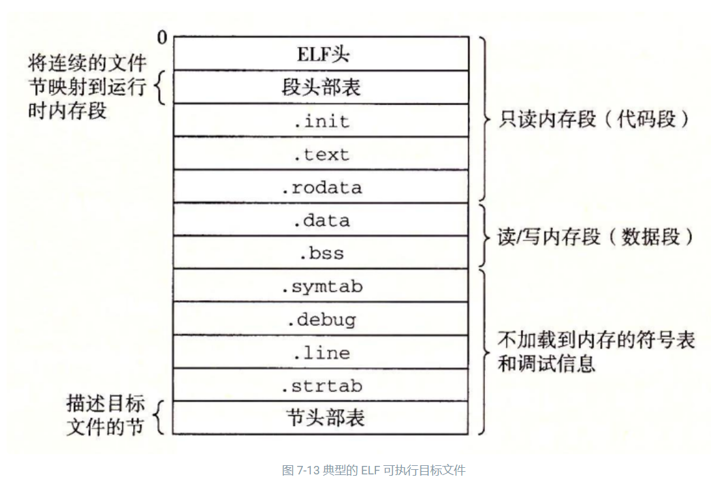

以下csapp (Computer Systems A Programmer's Perspective)指《深入理解计算机系统》(原书第3版)，csapp的截图部分来自这个[gitbook](https://hansimov.gitbook.io/csapp/)(作者[github](https://github.com/Hansimov/csapp)，不过作者没把整本书的gitbook做完）。有些图是找的pdf截的。
## 可执行文件格式
参考csapp:

目标文件有三种形式：

* 可重定位目标文件。包含二进制代码和数据，其形式可以在编译时与其他可重定位目标文件合并起来，创建一个可执行目标文件。
* 可执行目标文件。包含二进制代码和数据，其形式可以被直接复制到内存并执行。
* 共享目标文件。一种特殊类型的可重定位目标文件，可以在加载或者运行时被动态地加载进内存并链接。

编译器和汇编器生成可重定位目标文件（包括共享目标文件）。链接器生成可执行目标文件。从技术上来说，一个目标模块（object module）就是一个字节序列，而一个目标文件（object file）就是一个以文件形式存放在磁盘中的目标模块。不过，我们会互换地使用这些术语。

目标文件是按照特定的目标文件格式来组织的，各个系统的目标文件格式都不相同。从贝尔实验室诞生的第一个Unix系统使用的是a.out格式（直到今天，可执行文件仍然称为a.out文件）。Windows使用可移植可执行（Portable Executable，PE）格式。MacOS-X使用Mach-O格式。现代x86-64 Linux 和Unix系统使用可执行可链接格式（Executable and Linkable Format，ELF）。尽管我们的讨论集中在ELF上，但是不管是哪种格式，基本的概念是相似的。

典型的ELF可重定位目标文件格式：


典型的ELF可执行目标文件格式：



## 进程内存空间
参考csapp:


参考<https://blog.csdn.net/u013354486/article/details/111398333>：

0 ~ 0x400000的地址是空出来的，没有作用，不过肯定不需要存相关的页，此外0 ~ 0x400000不使用则NULL一定不会指向有效地址。

为什么要分.data段和.bss段？

参考<https://blog.csdn.net/Ivan804638781/article/details/110209548>：

在程序编译的时候，不会给.bss段中的数据分配空间，只是记录数据所需空间的大小。在程序执行的时候，才会给.bss段中的数据分配内存。通过这种方式，可以节省一部分内存空间，缩减可执行程序的大小。

## 函数调用是如何实现的
参考csapp:


参考：
* <https://www.cnblogs.com/rain-lei/p/3622057.html>
* <https://zhuanlan.zhihu.com/p/440016053>
* <https://blog.csdn.net/taugast/article/details/121174202>
* <https://zhuanlan.zhihu.com/p/27339191>
* <https://blog.csdn.net/Edidaughter/article/details/122334074>
* <https://rj45mp.github.io/ret%E6%8C%87%E4%BB%A4%E4%B8%8Ecall%E6%8C%87%E4%BB%A4%E7%9A%84%E6%B7%B1%E5%85%A5%E7%90%86%E8%A7%A3/>
* <https://zhuanlan.zhihu.com/p/77663680>

以一个最简单的test.c代码为例：
```C
#include <stdio.h>

int sub1(int x) {
    return x - 1;
}

int main(int argc, char **argv) {
    sub1(5);
}
```

ubuntu下`gcc -S test.c -masm=intel`生成test.s，分析这个汇编代码中sub1()函数的调用与返回。(windows下我用mingw-w64的gcc试了下，生成的汇编代码有些区别)

`gcc --version`:
```
gcc (Ubuntu 11.3.0-1ubuntu1~22.04.1) 11.3.0
Copyright (C) 2021 Free Software Foundation, Inc.
This is free software; see the source for copying conditions.  There is NO
warranty; not even for MERCHANTABILITY or FITNESS FOR A PARTICULAR PURPOSE.
```

PC(程序计数器)是抽象概念，实际x86-64机器中对应的寄存器是rip。x86寄存器的命名，以IP为例，16位的时候叫IP，32位叫EIP，64位叫RIP。

看这个汇编代码需要的一些补充信息：

rsp：堆栈指针寄存器，指向当前堆栈顶部，64位

rbp：基址指针寄存器，指向当前堆栈底部，64位

在子函数调用时，执行的操作有：父函数将调用参数从右向左压栈(参数少的话会直接用寄存器传参) -> 将返回地址压栈保存 -> 跳转到子函数起始地址执行 -> 子函数将父函数栈帧起始地址（%rbp）压栈 -> 将%rbp的值设置为当前%rsp的值，即将%rbp指向子函数栈帧的起始地址。

[这个](https://zhuanlan.zhihu.com/p/347445164)里面有句话对栈帧的含义总结比较好："函数的栈帧是指esp和ebp之间的一块地址"(或者说是一块内存区域，x86-64位机器下寄存器名字是rsp和rbp)，用来存放函数调用过程中的局部变量，参数，寄存器，返回地址等，从而实现函数调用。

参考[这个](https://www.zhihu.com/question/301000788)，寄存器有"调用者保存寄存器"和"被调用者保存寄存器"的概念，有些寄存器要由调用者保存(例如rax)，有些要由被调用者保存(例如rbp)。
```x86asm
	.file	"test.c"
	.intel_syntax noprefix
	.text
	.globl	sub1
	.type	sub1, @function
sub1:
.LFB0:
	.cfi_startproc
	endbr64
	push	rbp # 将rbp寄存器的值入栈，这个值是main()函数的栈底
	.cfi_def_cfa_offset 16 # 参考<https://zhuanlan.zhihu.com/p/74503126>，.cfi_def_cfa_offset 16做的是将cfa(Canonical Frame Address)赋为rsp + 16，即寄存器不变，偏移变成16；
	.cfi_offset 6, -16
	mov	rbp, rsp # rbp现在指向sub1()的栈底
	.cfi_def_cfa_register 6
	mov	DWORD PTR -4[rbp], edi # 这里参数少，所以通过寄存器传参，这里sub1()只有一个32位的参数，sub1()的参数x通过edi传递。edi是32位的寄存器，所以edi的值放在rbp-4的位置
	mov	eax, DWORD PTR -4[rbp] # 将x的值读进eax
	sub	eax, 1 # 计算x - 1
	pop	rbp # 恢复rbp的值，从而rbp此时指向main()函数栈底，此时rsp指向main()
	.cfi_def_cfa 7, 8
	ret # 此时rsp指向main()函数栈帧末尾的返回地址，ret会弹出返回地址，并设置rip为那个地址，相当于pop rip，从而实现返回到main()调用sub1()的下一行
	.cfi_endproc
.LFE0:
	.size	sub1, .-sub1
	.globl	main
	.type	main, @function
main:
.LFB1:
	.cfi_startproc
	endbr64
	push	rbp
	.cfi_def_cfa_offset 16
	.cfi_offset 6, -16
	mov	rbp, rsp
	.cfi_def_cfa_register 6
	sub	rsp, 16
	mov	DWORD PTR -4[rbp], edi # 保存main()的参数argc，由于main的参数只有2个，所以是用寄存器传给main()的，这里要把参数保存下来
	mov	QWORD PTR -16[rbp], rsi # 保存main()的参数argv
	mov	edi, 5 # 通过edi传递参数5，若不能用寄存器传递则会将参数入栈
	call	sub1 # call会将sub1()该返回的地址压入栈中(下一行的mov	eax, 0的地址)，并修改rip的值，跳到sub1()函数的入口
	mov	eax, 0
	leave
	.cfi_def_cfa 7, 8
	ret
	.cfi_endproc
.LFE1:
	.size	main, .-main
	.ident	"GCC: (Ubuntu 11.3.0-1ubuntu1~22.04.1) 11.3.0"
	.section	.note.GNU-stack,"",@progbits
	.section	.note.gnu.property,"a"
	.align 8
	.long	1f - 0f
	.long	4f - 1f
	.long	5
0:
	.string	"GNU"
1:
	.align 8
	.long	0xc0000002
	.long	3f - 2f
2:
	.long	0x3
3:
	.align 8
4:

```
sub1()的汇编代码中需要修改rbp(mov	rbp, rsp)使其指向sub1()的栈帧底，但rsp随着push，pop自动变，所以没有像rbp一样设置和恢复rsp的代码。

通过寄存器传递参数规则：


以上sub1()的参数确实是通过edi传递的，符合这个规则。

关于函数调用过程中返回值的传递，参考[这个](https://blog.csdn.net/thisinnocence/article/details/77141890):

* C函数传参：参数少或者传入的结构体小只借助寄存器即可，否则借助栈。
* C函数返回值：如果返回一个比较小的结构体，借助寄存器即可(返回基本类型应该都只需要通过寄存器返回就行)，否则依旧借助栈。按调用约定，当返回值是较大的结构体时，会在caller栈里产生一个临时变量(这里的临时变量的意思应该就是局部变量)，并将其首地址传给callee，callee返回值会修改此变量做到将返回值返回给caller。

上面的sub1()函数，返回值为int，所以是直接通过eax寄存器传递返回值的，将main函数的代码改成`int a = sub1(5);`，汇编中main函数相应的部分会变成:
```x86asm
...
call	sub1
mov	DWORD PTR -4[rbp], eax # 这里就是返回值赋值给a
...
```
对于调用函数返回结构体的情况，以以下代码为例:
```C
#include <stdio.h>

struct Value {
    int value1;
    int value2;
    int value3;
    int value4;
    int value5;
};

struct Value test() {
    struct Value v;
    v.value1 = 7;
    return v;
}

int main(int argc, char **argv) {
    struct Value v = test();
    v.value1 = 5;
    v.value5 = 6;
}
```
`gcc -S test.c -masm=intel -o test.s`得到的汇编代码为:
```x86asm
	.file	"test.c"
	.intel_syntax noprefix
	.text
	.globl	test
	.type	test, @function
test:
.LFB0:
	.cfi_startproc
	endbr64
	push	rbp
	.cfi_def_cfa_offset 16
	.cfi_offset 6, -16
	mov	rbp, rsp
	.cfi_def_cfa_register 6
	mov	QWORD PTR -40[rbp], rdi # rdi是main中的要用来接收返回值的struct Value v的地址
	mov	DWORD PTR -32[rbp], 7 # test的栈帧中也有个结构体变量v，这行对应v.value1 = 7;
	mov	rcx, QWORD PTR -40[rbp] # main的v的地址存入rcx
	mov	rax, QWORD PTR -32[rbp] # test的v.value1, value2(加起来64位)存入rax
	mov	rdx, QWORD PTR -24[rbp] # test的v.value3, value4(加起来64位)存入rdx
	mov	QWORD PTR [rcx], rax # test的v.value1, value2存入main的v.value1, value2
	mov	QWORD PTR 8[rcx], rdx # test的v.value3, value4存入main的v.value3, value4
	mov	eax, DWORD PTR -16[rbp] # 最后test的v.value5存入eax(注意这里是DWORD，32位)
	mov	DWORD PTR 16[rcx], eax # test的v.value5存入main的v.value5
	mov	rax, QWORD PTR -40[rbp]
	pop	rbp
	.cfi_def_cfa 7, 8
	ret
	.cfi_endproc
.LFE0:
	.size	test, .-test
	.globl	main
	.type	main, @function
main:
.LFB1:
	.cfi_startproc
	endbr64
	push	rbp
	.cfi_def_cfa_offset 16
	.cfi_offset 6, -16
	mov	rbp, rsp
	.cfi_def_cfa_register 6
	sub	rsp, 48
	mov	DWORD PTR -36[rbp], edi
	mov	QWORD PTR -48[rbp], rsi
	mov	rax, QWORD PTR fs:40
	mov	QWORD PTR -8[rbp], rax
	xor	eax, eax
	lea	rax, -32[rbp] # -32[rbp]是main的栈帧中value1的地址(也是结构体的首地址)
	mov	rdi, rax # 通过rdi传递结构体首地址
	mov	eax, 0
	call	test
	mov	DWORD PTR -32[rbp], 5 # 对应v.value1 = 5;
	mov	DWORD PTR -16[rbp], 6 # 对应v.value5 = 6;
	mov	eax, 0
	mov	rdx, QWORD PTR -8[rbp]
	sub	rdx, QWORD PTR fs:40
	je	.L5
	call	__stack_chk_fail@PLT
.L5:
	leave
	.cfi_def_cfa 7, 8
	ret
	.cfi_endproc
.LFE1:
	.size	main, .-main
	.ident	"GCC: (Ubuntu 11.3.0-1ubuntu1~22.04.1) 11.3.0"
	.section	.note.GNU-stack,"",@progbits
	.section	.note.gnu.property,"a"
	.align 8
	.long	1f - 0f
	.long	4f - 1f
	.long	5
0:
	.string	"GNU"
1:
	.align 8
	.long	0xc0000002
	.long	3f - 2f
2:
	.long	0x3
3:
	.align 8
4:

```
以上的汇编代码可以看出调用的函数返回结构体时，caller传递自己的局部变量地址，callee将自己栈帧中的结构体复制到caller栈帧中的结构体的过程，从而实现返回结构体。

函数调用时，函数代码是在代码段的，而代码段是只读的，所以多线程调用同一个函数没有竞争问题。函数读写的变量在栈帧（局部变量）或者堆区（或者一些全局的变量，在.data或者.bss段）。此外，局部变量也应该没有竞争问题（虽然理论上可以通过指针强行修改别的线程的栈）。

## 关于栈区大小
参考<https://zhuanlan.zhihu.com/p/630470896>:

进程栈的初始化大小是由编译器和链接器计算出来的，但是栈的实时大小并不是固定的，Linux内核会根据入栈情况对栈区进行动态增长（其实也就是添加新的页表）。但是并不是说栈区可以无限增长，它也有最大限制RLIMIT_STACK(一般为8M)，我们可以通过ulimit来查看或更改RLIMIT_STACK的值。(也可以通过调用pthread_attr_setstacksize()来设置)

参考<https://www.baeldung.com/linux/kernel-stack-and-user-space-stack>:

Within a call stack, we can find a series of stack frames. A stack frame consists of data relevant to a particular function. It usually includes function arguments, the return address, and local data. As we go deep into the call graph(应该是chain), more frames are allocated, which increases the size of the call stack.

gcc可以用-Wl,--stack=SIZE_STACK设置栈大小，而`gcc -v --help`结果里对--stack的说明为：`--stack <size>    Set size of the initial stack`。这里设置栈大小的原理可能是ELF头里有相应的配置字段？

参考<https://stackoverflow.com/questions/4918835/how-does-the-operating-system-detect-a-stack-overflow>:

The OS allocates some space to the stack. When the process accesses an unallocated part of the stack, a page fault is raised by the processor and caught by the OS. If the OS believes it's still reasonable to grow the stack, it simply allocates new space for it and returns control to the process. If it's not reasonable, a stack overflow exception is raised.

参考<https://www.jianshu.com/p/1669ab09c6c4>:

每个线程的栈会存在guard page保护页， 这种保护页是没有权限的。当一个线程进入了另一个线程的guard page， 出现page falult则程序崩溃。

参考<https://stackoverflow.com/questions/18278803/how-does-elf-file-format-defines-the-stack>:

Each stack is separated by a guard page to detect Stack-Overflow

按理说，由于栈区域可能扩张，那么为了防止栈扩张时与已分配的共享库映射区域重合，共享库映射区域在使用时应该会在栈区域可能的最大位置以下进行内存分配。

pthread_attr_setstacksize()是在运行时设置栈大小(主线程也可以设置)，这是怎么实现的？

参考<https://www.zhihu.com/question/26997321/answer/34840959>:

因为栈必须用固定的连续地址空间，所以必须提前分配好。即使有空闲内存、空闲地址空间，但是如果它不和当前的栈连在一起，当前线程也是不能用的。（很多系统上，都有库函数帮你调栈，用另一段地址作栈，实现coroutine。但是这需要特别的处理，不是直接用普通函数就可以的）

可能是通过mmap()分配内存用作新的调用栈，然后复制旧栈中内容并改寄存器之类的？

## 关于动态库的加载
参考：
* <https://juejin.cn/post/7041100056199446565>
* <https://www.zhihu.com/question/29988788/answer/46330349>

动态库是在程序运行时，由程序自己调用系统API去加载的，而不是内核加载程序时顺便加载的。也就是说，共享库内存映射区域的内存完全是由语言来分配的。

动态库的加载也分load time dynamic linking和run time dynamic linking。

load time dynamic linking是指在编译时提供链接库名的那种。

run time dynamic linking用的是dlopen()，但是dlopen()不是系统调用而是库函数，内部应该是用mmap()将目标代码映射到共享库内存映射区域。

关于动态库在进行函数调用时，如何找到函数的位置(因为可执行程序中没有动态库函数的目标代码，无法知道函数地址)，csapp 7.12节有相关内容。

## 关于动态内存分配
参考:
* <https://www.cnblogs.com/vinozly/p/5489138.html>
* <https://juejin.cn/post/7041100056199446565>
* <https://zhuanlan.zhihu.com/p/601772442>

栈区和堆区都能在运行时动态变化，那运行时如何防止栈区共享库内存映射区域和堆区重合（例如，共享库内存映射区域可能已经在贴到堆区的位置分配了内存，但此时堆区需要增长）？

栈区我猜测应该会预留空间到栈可能的最大空间，例如默认栈最大8M，那么即使现在栈帧用不满这8M，共享库内存映射区域也不会来占据这8M。

而关于共享库内存映射区域与堆区，实际c的malloc库，是调用[brk()](https://man7.org/linux/man-pages/man2/brk.2.html)和[mmap()](https://man7.org/linux/man-pages/man2/mmap.2.html)这两个系统调用来分配内存的，malloc()本身不是系统调用。

1. 用brk()分配是将数据段(.data)的最高地址指针_edata(也可以视作堆顶指针)往高地址推。[brk() manpage](https://man7.org/linux/man-pages/man2/brk.2.html)中的描述为：brk() and sbrk() change the location of the program break, which defines the end of the process's data segment (i.e., the program break is the first location after the end of the uninitialized data segment).

2. 用mmap()分配是在共享库内存映射区域分配内存。(mmap()除了映射文件到内存，指定MAP_ANONYMOUS参数时相当于动态分配内存)。mmap()以页为单位进行，参考[mmap() manpage](https://man7.org/linux/man-pages/man2/mmap.2.html): "A file is mapped in multiples of the page size.  For a file that is not a multiple of the page size, the remaining bytes in the partial page at the end of the mapping are zeroed when mapped, and modifications to that region are not written out to the file."

这两种方式分配的都是虚拟内存，没有分配物理内存。在第一次访问已分配的虚拟地址空间的时候，发生缺页中断，操作系统负责分配物理内存，然后建立虚拟内存和物理内存之间的映射关系(懒加载)。

malloc()的实现，malloc()小于128k的内存，使用brk()分配内存；malloc()大于128k的内存，使用mmap()分配内存。

例如：


brk分配的内存需要等到高地址内存释放以后才能释放（例如，在B释放之前，A不能释放，因为只有一个_edata指针），而mmap分配的内存可以单独释放。

不过还是不知道这种情况是怎么处理的：在共享库内存映射区域靠近_edata的位置申请了内存，导致_edata无法再增长。

## 多线程下调用栈是怎么样的
参考:
* <https://www.zhihu.com/question/27645594/answer/217480086>
* <https://zhuanlan.zhihu.com/p/579996502>
* <https://zhuanlan.zhihu.com/p/630470896>
* <https://zhuanlan.zhihu.com/p/589443291>
* <https://www.zhihu.com/question/323415592/answer/676335264>
* <https://www.zhihu.com/question/552113583/answer/2663970425>
* <https://zhuanlan.zhihu.com/p/59065065>

按理说，要实现多线程，只需要给每个线程准备一个调用栈，然后由操作系统调度cpu核来取指执行。参考<https://www.zhihu.com/question/323415592/answer/676335264>中的内容：“线程获得执行权”实质上就是把对应线程的栈顶指针等信息载入CPU的栈指示器，使得它沿着这条调用链继续执行下去——执行一段时间，把它的栈顶指针等信息找个地方保存、然后载入另一个线程的栈顶指针等信息，这就是所谓的“线程切换”。

参考csapp:


每个线程都会有一个调用栈，但是csapp里并没提多线程下其它线程的栈在哪里。

参考<https://www.zhihu.com/question/27645594/answer/217480086>：

Linux下，线程和进程区别不大，都有task_struct进程描述符。多线程进程可以看作是几个共享地址空间的进程的集合。但多线程一定是由一个主线程开始，这个主线程启动其他线程。主线程的线程栈在内核空间位置附近（应该就是上面的图里的用户栈），大小为8MB，其他线程的线程栈是主线程在调用pthread_create创建线程时，由mmap分配的，所以这些线程栈在mmap的区域内，跟共享库入口同属一个区域，phtread_t tid中存储的就是线程结构体在mmap区域中的入口。普通线程栈的默认大小也是8MB，但是因为是动态分配的，所以可以在线程属性设置函数中调整线程栈的大小（主线程也可以修改栈大小）。

参考<https://zhuanlan.zhihu.com/p/630470896>：

从Linux内核的角度来说，其实它并没有线程的概念。Linux把所有线程都当做进程来实现，它将线程和进程不加区分的统一到了task_struct中。线程仅仅被视为一个与其他进程共享某些资源的进程，而是否共享地址空间几乎是进程和Linux中所谓线程的唯一区别。线程创建的时候，加上了CLONE_VM标记，这样线程的内存描述符将直接指向父进程的内存描述符。

虽然线程的地址空间和进程一样，但是对待其地址空间的stack还是有些区别的。对于Linux进程或者说主线程，其stack是在fork的时候生成的，实际上就是复制了父亲的stack空间地址，然后写时拷贝(cow)以及动态增长。然而对于主线程生成的子线程而言，其stack将不再是这样的了，而是使用mmap系统调用生成的，它不带有VM_STACK_FLAGS标记。这个可以从glibc的nptl/allocatestack.c中的allocate_stack()函数中看到：
```
mem = mmap (NULL, size, prot,
            MAP_PRIVATE | MAP_ANONYMOUS | MAP_STACK, -1, 0);
```
[clone()](https://man7.org/linux/man-pages/man2/clone.2.html)函数：
```
These system calls create a new ("child") process, in a manner
similar to fork(2).

By contrast with fork(2), these system calls provide more precise
control over what pieces of execution context are shared between
the calling process and the child process.  For example, using
these system calls, the caller can control whether or not the two
processes share the virtual address space, the table of file
descriptors, and the table of signal handlers (fork()出的子进程会继承信号处理函数).
These system calls also allow the new child process to be placed in separate
namespaces(7).

int clone(int (*fn)(void *_Nullable), void *stack, int flags,
                 void *_Nullable arg,
				 ...  /* pid_t *_Nullable parent_tid,
                        void *_Nullable tls,
                        pid_t *_Nullable child_tid */ );
```
第二个参数就是指定栈地址，不过clone()的参数里没有指明栈大小的参数，第四个参数arg是fn的参数，[man page](https://man7.org/linux/man-pages/man2/clone.2.html)原文："Note that clone() does not provide a means whereby the caller can inform the kernel of the size of the stack area."。但是[clone3()](https://man7.org/linux/man-pages/man2/clone.2.html)这个函数里有指明栈大小的参数。

[fork()](https://man7.org/linux/man-pages/man2/fork.2.html)的man page原文："Since glibc 2.3.3, rather than invoking the kernel's fork() system call, the glibc fork() wrapper that is provided as part of the NPTL(Native POSIX Threads Library) threading implementation invokes clone(2) with flags that provide the same effect as the traditional system call. (A call to fork() is equivalent to a call to clone(2) specifying flags as just SIGCHLD.)"

参考<https://zhuanlan.zhihu.com/p/589443291>：

创建线程的函数pthread_create内部使用的也是clone函数。在glibc的/sysdeps/unix/sysv/linux/createthread.c源码中可以看到，创建线程的函数create_thread中使用了clone函数，并指定了相关的flags。

也就是说，创建进程和线程底层都相当于是clone()这个系统调用，只是调用方式不同。创建进程还可以直接用fork()。

[这个](https://zhuanlan.zhihu.com/p/579996502)链接里演示了使用自己申请的内存空间当作线程的栈使用，通过pthread_attr_setstack()函数。

1. 使用malloc函数申请内存空间，这部分空间在堆当中。
2. 使用mmap系统调用在共享库的映射区申请内存空间。

[mmap()](https://man7.org/linux/man-pages/man2/mmap.2.html)除了映射动态库，好像也可以用来申请共享库映射区域内存，当指定MAP_ANONYMOUS参数时"The mapping is not backed by any file (意思应该是映射不涉及文件，从而相当于申请共享库映射区域内存); its contents are initialized to zero. The fd argument is ignored;"

**使用 malloc 函数申请内存空间**

```
#include <stdio.h>
#include <pthread.h>
#include <stdlib.h>

#define MiB * 1 << 20

int times = 0;
static
void* stack_overflow(void* args) {
  printf("times = %d\n", ++times);
  char s[1 << 20]; // 1 MiB
  stack_overflow(NULL);
  return NULL;
}

int main() {
  pthread_attr_t attr;
  pthread_attr_init(&attr);
  void* stack = malloc(2 MiB); // 使用malloc函数申请内存空间，申请的空间大小为2MiB 
  pthread_t t;
  pthread_attr_setstack(&attr, stack, 2 MiB); // 使用属性设置函数设置栈的位置 栈的最低地址为 stack 栈的大小等于 2 MiB 
  pthread_create(&t, &attr, stack_overflow, NULL);
  pthread_join(t, NULL);
  pthread_attr_destroy(&attr); // 释放系统资源
  free(stack); // 释放堆空间
  return 0;
}
```

**使用 mmap 申请内存作为栈空间**
```
#define _GNU_SOURCE
#include <stdio.h>
#include <pthread.h>
#include <stdlib.h>
#include <sys/mman.h>

#define MiB * 1 << 20
#define STACK_SIZE 2 MiB

int times = 0;

static
void* stack_overflow(void* args) {
  printf("times = %d\n", ++times);
  char s[1 << 20]; // 1 MiB
  stack_overflow(NULL);
  return NULL;
}

int main() {
  pthread_attr_t attr;
  pthread_attr_init(&attr);
  void* stack = mmap(NULL, STACK_SIZE, PROT_READ | PROT_WRITE,
                MAP_PRIVATE | MAP_ANONYMOUS | MAP_STACK, -1, 0);
  if (stack == MAP_FAILED)
      perror("mapped error:");
  pthread_t t;
  pthread_attr_setstack(&attr, stack, STACK_SIZE);
  pthread_create(&t, &attr, stack_overflow, NULL);
  pthread_join(t, NULL);
  pthread_attr_destroy(&attr);
  free(stack);
  return 0;
}
```

总之，多线程下每个线程都会有一个调用栈，对于linux下的pthread库来说，主线程用的是进程内存映像里的用户栈，而通过pthread_create()创建的线程用的调用栈则是由mmap()申请的内存空间。此外，pthread_create()中使用了[clone()](https://man7.org/linux/man-pages/man2/clone.2.html)函数，而clone()是个系统调用(manpage里clone()的[section](https://man7.org/linux/man-pages/man7/man-pages.7.html)编号是2)，因此pthread_create()创建的线程，操作系统是知道的，将线程调度到处理器执行也应该是由操作系统来做的。

## 线程切换时，线程的上下文保存在哪里？
参考[这个](https://segmentfault.com/q/1010000003003454)：

"这个要看具体的线程实现。

据我所知，以Linux的pthread为例，它的一个线程，在内核里和进程是同样的调度单位，相关信息都保存在其对应的task_struct结构体里面。

Gnu Pth这种内核之上的线程库，则采用另一种实现，我没看过源码，但是合理猜测，必然也是用了类似的一个结构体来保存相关信息。"

task_struct是PCB概念在linux下的具体实现，参考<https://zhuanlan.zhihu.com/p/360367089>：

"task_struct 包含了这些内容：... 上下文数据：进程执行时处理器的寄存器中的数据 ..."

也就是说，线程上下文切换时PCB会来保存寄存器信息。

## 为什么主线程退出进程会退出
参考caspp:


不过上面的汇编代码里没看到call exit之类的代码，应该是__libc_start_main()调用完main()函数后会调exit()。

参考[这个](https://refspecs.linuxbase.org/LSB_3.1.0/LSB-generic/LSB-generic/baselib---libc-start-main-.html)：

