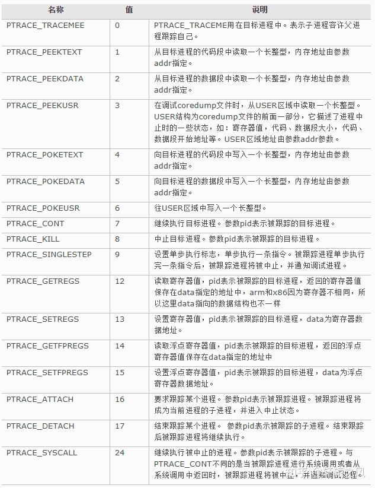

参考链接：
* [玩转ptrace (一)](https://www.cnblogs.com/catch/p/3476280.html)
* [GDB调试之ptrace实现原理](https://blog.csdn.net/Rong_Toa/article/details/109499859)
* [GDB原理之ptrace实现原理](https://cloud.tencent.com/developer/article/1742878)
* [原来gdb的底层调试原理这么简单](https://zhuanlan.zhihu.com/p/336922639)
* [调试器是个大骗子！](https://zhuanlan.zhihu.com/p/626959458)
* [搞懂GDB的实现原理（我真的不懂）](https://zhuanlan.zhihu.com/p/469781175)
* [int 3中断与软件调试](https://blog.csdn.net/trochiluses/article/details/20209593)
* [线程的查看以及利用gdb调试多线程](https://blog.csdn.net/zhangye3017/article/details/80382496)
* [ptrace修改内存实现进程代码注入](https://blog.csdn.net/u011580175/article/details/82831889)
* [creating a pipe from a parent process stdin to a childprocess stdin](https://stackoverflow.com/questions/5066064/creating-a-pipe-from-a-parent-process-stdin-to-a-childprocess-stdin)

大致理解一下调试器是怎么实现的，以下都是linux环境下的。

## ptrace
实现调试功能的核心是ptrace系统调用。
```
#include <sys/ptrace.h>

long ptrace(enum __ptrace_request request, pid_t pid, void *addr, void *data);
```
[manpage](https://man7.org/linux/man-pages/man2/ptrace.2.html)对ptrace的description:
```
The ptrace() system call provides a means by which one process
(the "tracer") may observe and control the execution of another
process (the "tracee"), and examine and change the tracee's
memory and registers.  It is primarily used to implement
breakpoint debugging and system call tracing.

A tracee first needs to be attached to the tracer.  Attachment
and subsequent commands are per thread: in a multithreaded
process, every thread can be individually attached to a
(potentially different) tracer, or left not attached and thus not
debugged.  Therefore, "tracee" always means "(one) thread", never
"a (possibly multithreaded) process".  Ptrace commands are always
sent to a specific tracee using a call of the form

    ptrace(PTRACE_foo, pid, ...)

where pid is the thread ID of the corresponding Linux thread.

(Note that in this page, a "multithreaded process" means a thread
group consisting of threads created using the clone(2) CLONE_THREAD flag.)

...

While being traced, the tracee will stop each time a signal is
delivered, even if the signal is being ignored.  (An exception is
SIGKILL, which has its usual effect.)  The tracer will be
notified at its next call to waitpid(2) (or one of the related
"wait" system calls); that call will return a status value
containing information that indicates the cause of the stop in
the tracee.  While the tracee is stopped, the tracer can use
various ptrace requests to inspect and modify the tracee.  The
tracer then causes the tracee to continue, optionally ignoring
the delivered signal (or even delivering a different signal
instead).

...

    PTRACE_ATTACH
        Attach to the process specified in pid, making it a tracee
        of the calling process.  The tracee is sent a SIGSTOP, but
        will not necessarily have stopped by the completion of
        this call; use waitpid(2) to wait for the tracee to stop.
        See the "Attaching and detaching" subsection for
        additional information.  (addr and data are ignored.)
```
wait()的[man page](https://man7.org/linux/man-pages/man2/wait.2.html):
```
All of these system calls are used to wait for state changes in a
child of the calling process, and obtain information about the
child whose state has changed.  A state change is considered to
be: the child terminated; the child was stopped by a signal; or
the child was resumed by a signal.
```
文档中的关键信息：在被trace的情况下，tracee每收到一次信号就会暂停执行（这个each time a signal is delivered应该是每收到一次信号而不是每发出一次信号，因为后面说SIGKILL的行为是一样的，tracee应该是收到SIGKILL信号而不是发出），tracer在循环中调用wait系函数，通过wait系函数的返回知道子进程的暂停，然后通过ptrace读取tracee的相关信息（寄存器值等等）以及控制tracee继续执行。

ptrace的request选项及作用参考[这个](https://zhuanlan.zhihu.com/p/626959458)里面总结的：



## 启动调试的两种情景
1. 自行创建被调试进程

    使用fork()创建出一个新的子进程，然后子进程需要先调用`ptrace(PTRACE_TRACEME, ...)`让子进程变为traced状态，然后在子进程中通过exec*()来执行想要调试的程序，而按照execve()的[man page](https://man7.org/linux/man-pages/man2/execve.2.html): 
    "If the current program is being ptraced, a SIGTRAP signal is sent to it after a successful execve()."。因此，当调用exec*()之后，由于已调用了`ptrace(PTRACE_TRACEME, ...)`让子进程变为了traced状态，在调用了exec*()之后子进程就会收到SIGTRAP信号并阻塞，从而父进程的wait()能够返回，这样一开始tracee就是暂停住等待tracer控制的。

2. 调试已存在的进程

    使用`ptrace(PTRACE_ATTACH, ...)`可以attach到已经执行的进程，并把进程收养成为自己的子进程，tracer会向tracee发送SIGSTOP。然后tracer通过调用waitpid()返回知道子进程已经暂停下来。

参考链接有些说"gdb进程接管了test进程的所有信号，也就是说系统向test进程发送的所有信号，都被gdb进程接收到，这样一来，test进程的执行就被gdb控制了，从而达到调试的目的。"，实际看下来不是这么回事。

一个使用ptrace的样例代码，来自[GDB原理之ptrace实现原理](https://cloud.tencent.com/developer/article/1742878)。
```C
#include <sys/ptrace.h>
#include <sys/types.h>
#include <sys/wait.h>
#include <unistd.h>
#include <sys/user.h>
#include <stdio.h>

int main()
{   pid_t child;
    struct user_regs_struct regs;

    child = fork();
    if(child == 0) {
        ptrace(PTRACE_TRACEME, 0, NULL, NULL);
        execl("/bin/ls", "ls", NULL);
    }
    else {
        // 实际以下应该写在一个死循环里，然后一次wait结束代表子进程停住，然后父进程通过ptrace控制子进程执行
        wait(NULL);
        ptrace(PTRACE_GETREGS, child, NULL, &regs);
        printf("Register: rdi[%llu], rsi[%llu], rdx[%llu], rax[%llu], orig_rax[%llu], rip[%llu]\n",
                regs.rdi, regs.rsi, regs.rdx,regs.rax, regs.orig_rax, regs.rip);
        ptrace(PTRACE_CONT, child, NULL, NULL);
        sleep(1);
    }
    return 0;
}
```

## 实现调试功能

### 实现单步调试
以gdb为例，`gdb 可执行文件`之后，首先会启动一个gdb进程，然后gdb会fork()一个子进程，然后用exec*()来让子进程运行对应的可执行程序。如前所述，此时子进程会停止，父进程通过wait系函数知道子进程已经停止，然后就可以调用`ptrace(PTRACE_SINGLESTEP, ...)`来让tracee以单步模式执行。这里的单步模式是单instruction。单instruction执行的原理参考[这个](https://zhuanlan.zhihu.com/p/626959458)是通过设置CPU的标志寄存器的Trap Flag位执行的，TF标志位用来告诉CPU进入单步执行模式，只要把这个标记为设置为1，CPU每执行一条指令，就会触发一次调试异常，调试异常的向量号是1，所以触发的时候，会取出IDT中的1号表项中的处理函数来执行，当该位复位后，CPU恢复正常工作。这样tracee就单步执行了一条指令并停止，从而tracer的wait()返回，从而tracer可以控制tracee的下一步执行。

注意，这里的单步模式是单instruction，实际调试器提供的功能是单行执行，所以调试器需要知道某一行源代码对应的指令的范围（应该是来自可执行文件里的.debug段），从而连续单步执行直到执行完那一行源代码对应的指令，从而完成单行执行。

### 实现断点
参考[这个](https://zhuanlan.zhihu.com/p/626959458)，在某一行打断点，首先需要找到那一行对应的第一条指令（可执行文件中的.debug段），然后调试器会把被调试进程中那个位置的指令修改为一个0xCC，这是一条特殊指令的CPU机器码——int 3，仅有一个字节，是x86架构CPU专门用来支持调试的指令。一旦被调试的进程运行到那个位置，CPU执行这条特殊的指令时，会陷入内核态，然后取出中断描述符表IDT中的3号表项中的处理函数来执行，被调试的进程会接收到SIGTRAP信号。从而tracee会停止，tracer的wait()返回，tracer控制tracee的下一步执行。

此时，tracee刚刚执行完int 3，若要继续执行，此时应该是需要将rip回退1（应该是通过PTRACE_SETREGS设置的rip，好像PTRACE_SETREGS能有改rip的权限，参考[这个](https://blog.csdn.net/u011580175/article/details/82831889)），然后将int 3原来的指令写回。这样就可以恢复之前的执行。只是，为了让下次执行到这里时还能命中断点，调试器需要单步执行一次，执行完了原来的指令后，再将断点位置内存内容重新设置为int 3。

参考[这个](https://blog.csdn.net/trochiluses/article/details/20209593)：在调试器下，我们是看不到动态替换到程序中的INT 3指令的。大多数调试器的做法是在被调试程序中断到调试器时，会先将所有断点位置被替换为INT 3的指令恢复成原来的指令，然后再把控制权交给用户。

### 继续执行
应该是调用`ptrace(PTRACE_CONT, ...)`实现。然后执行到设置的断点(int 3)才会停止。

### 条件断点与内存断点
以某个表达式的是否成立作为条件，从而决定自身是否生效的断点，称为条件断点。

在指定的地址处的变量被修改时，才会触发的断点，称为内存断点。

参考[这个](https://zhuanlan.zhihu.com/p/626959458)：

条件断点和内存断点应该都可以通过单步执行来实现，每执行一步就进行判断，效率会较低。

内存断点可以使用硬件断点的能力，在x86架构CPU的内部内置了一组调试寄存器，从DR0到DR7，总共8个。通过在DR0-DR3中设置要监控的内存地址，然后在DR7中设置要监控的模式，是读还是写。CPU执行的时候，一旦发现有符合调试寄存器中设置的情况发生时，就会产生调试异常，然后取出IDT中的1号表项中的处理函数来执行，接下来的事情就跟单步调试产生的异常差不多了。

## 调试多线程
参考[上面](#ptrace)列出的ptrace文档内容和[这个](https://blog.csdn.net/zhangye3017/article/details/80382496)，调试多线程要分别attach到各个线程，否则其它线程不在debug状态，linux下进程与线程地位比较近，线程的线程id地位类似pid，用`ptrace(PTRACE_foo, pid, ...)`调试线程时这个pid是线程id。

## IDE是如何使用gdb的
IDE应该是fork()一个gdb进程，然后将用户的调试动作转化成指令输入给gdb进程。IDE如何将操作指令给到fork()出的gdb进程的输入流？

实现方式参考：
* [creating a pipe from a parent process stdin to a childprocess stdin](https://stackoverflow.com/questions/5066064/creating-a-pipe-from-a-parent-process-stdin-to-a-childprocess-stdin)
* [linux环境下，如何将stdin以及stdout重定向至管道？](https://www.zhihu.com/question/494688715/answer/2190274951)
* [Linux中fork子进程后再exec新程序时文件描述符的问题？](https://www.zhihu.com/question/49609592/answer/1709625471)

关键点是dup2()函数，把fork出的子进程的stdin替换掉，然后IDE只需向管道写，gdb进程就能从stdin接收到debug指令。这里没调exec*()，不知道exec*()之后会不会重置stdin，不过按参考链接的说法：
> 默认情况下，由exec()的调用程序所打开的所有文件描述符在exec()的执行过程中会保持打开状态，且在新程序中依然有效。

应该是不会。
```
#include <stdio.h>
#include <stdlib.h>
#include <unistd.h>
#include <sys/prctl.h>
#include <signal.h>
#include <string.h>

int main(int argc, char const *argv[])
{
    int fds[2];
    pipe(fds);
    int pid = fork();
    if (pid == 0) {
        prctl(PR_SET_PDEATHSIG,SIGKILL);
        // int dup2(int __fd, int __fd2) Duplicate FD to FD2, closing FD2 and making it open on the same file.
        dup2(fds[0], 0);
        while (1) {
            char buf[50] = {0};
            read(0, buf, 50);
            printf("in child process, read from stdin: %s\n", buf);
            sleep(3);
        }
    }
    else {
        while (1) {
            write(fds[1], "aasss", strlen("aasss"));
            sleep(3);
        }
    }
    return 0;
}
```