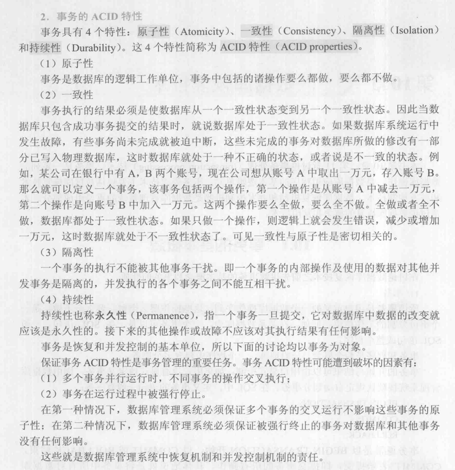
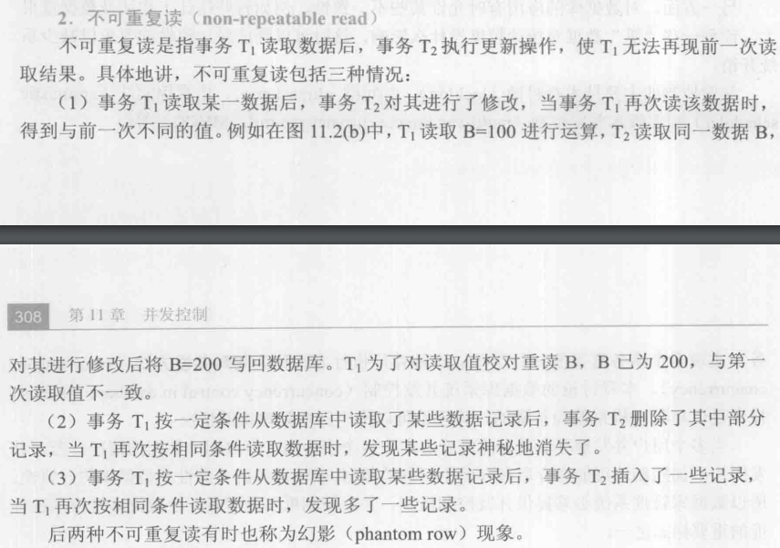
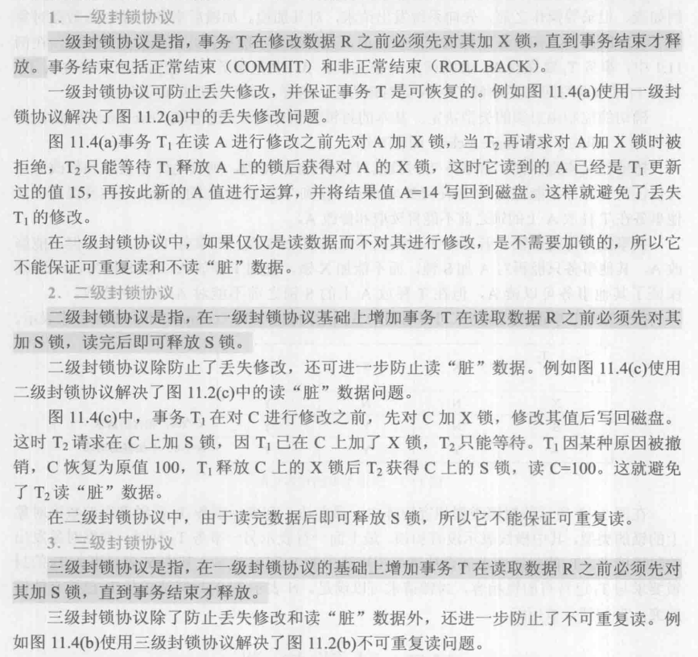

参考：
* 《数据库系统概论》(第5版) ISBN 9787040406641
* [理解事务的4种隔离级别](https://developer.aliyun.com/article/603802)
* [数据库的隔离级别与丢失更新、脏读、不可重复读、幻读详解](https://blog.csdn.net/qq_37771475/article/details/86493631)
* [MySQL事务隔离级别中可重复读与幻读](https://zhuanlan.zhihu.com/p/148086115)
* [SQL知识点--事务](https://zhuanlan.zhihu.com/p/266789217)
* [mysql 事务中如果有sql语句出错，会导致自动回滚吗](https://blog.csdn.net/m0_59176231/article/details/127050349)
* [MySQL 事务](https://www.runoob.com/mysql/mysql-transaction.html)
* [高并发下丢失更新的解决方案](https://zhuanlan.zhihu.com/p/586243103)
* [MySQL事务的隔离性是如何实现的？](https://cloud.tencent.com/developer/article/1884107)
* [Mysql为何使用可重复读(Repeatable read)为默认隔离级别?](https://zhuanlan.zhihu.com/p/379961203)
* [MySQL读未提交级别究竟是否加锁](https://blog.csdn.net/Elvenlegolas/article/details/121167976)
* [Select for update使用详解](https://zhuanlan.zhihu.com/p/143866444)
* [autocommit, Commit, and Rollback](https://dev.mysql.com/doc/refman/8.0/en/innodb-autocommit-commit-rollback.html)
* [Statements That Cause an Implicit Commit](https://dev.mysql.com/doc/refman/5.7/en/implicit-commit.html)
* [数据库中为什么需要Implict Commit（隐式提交事务）](https://blog.csdn.net/maray/article/details/46410817)
* [并发insert情况下会发生重复的数据插入问题](https://blog.csdn.net/lululove19870526/article/details/60592981)
## 事务的定义
事务是用户定义的一个数据库操作序列，这些操作要么全做，要么全不做，是一个不可分割的工作单位。

事务以begin或start transaction语句开始，以commit/rollback语句结束，如果事务中有sql语句错误(比如没有对应表)，事务会自动回滚，也可以用rollback语句手动回滚。

## ACID
参考《数据库系统概论》的内容：



这里的隔离性的描述是串行化的隔离级别才能达到的了，实际还有较弱的几个隔离等级。也就是说，实际数据库如果不用串行化的隔离级别，达不到这里描述的隔离性要求。从而会出现脏读、不可重复读等事务问题并发现象。

## 事务并发问题
* 脏读

    一个事务读到了另一个事务中未提交的数据。

* 不可重复读

    一个事务在未提交之前，多次读取同一数据，但读到的结果却是不一样的，称为不可重复读。

* 幻读

    一个事务在未提交之前，多次读取交易记录，第一次读到了n条记录，但第二次却读到了!=n条数据。幻读其实也是不可重复读，但幻读侧重的是数据的新增或删除，而不可重复读侧重的是同一行数据的修改。

    《数据库系统概论》中幻读就归类为不可重复读：
    
    

* 丢失更新（也叫丢失修改）

1. 第一类丢失更新

    | 时刻 | 事务1 | 事务2 |
    | --- | --- | --- |
    | T1 | 初始库存100 | 初始库存100 |
    | T2 | 扣减库存，余99 |	| 
    | T3 | | 扣减库存，余99 |
    |T4	| | 提交事务，库存变为99 |
    |T5	| 回滚事务，库存100 | |
    
    T5时刻事务1回滚，导致原本库存为99的变为了100，这导致事务2的提交结果丢失了。

    事务A回滚导致的事务B的更新丢失，称为第一类丢失更新。

    参考[这个](https://zhuanlan.zhihu.com/p/586243103)："第一类丢失更新：A事务撤销时，把已经提交的B事务的更新数据覆盖了。SQL标准中未对此做定义，所有数据库都已解决了第一类丢失更新的问题。"

2. 第二类丢失更新

    | 时刻 | 事务1 | 事务2 |
    | --- | --- | --- |
    | T1 | 初始库存100 | 初始库存100 |
    | T2 | 扣减库存，余99 |	| 
    | T3 | | 扣减库存，余99 |
    | T4 | | 提交事务，库存变为99 |
    | T5 | 提交事务，库存变为99 | |

    对于T5时刻提交的事务。因为在事务1中，无法感知事务2的操作，这样它就不知道事务2已经修改过了数据，因此它依旧认为只是发生了一笔业务，所以库存变成了99，这导致事务2提交的结果丢失。

    事务A覆盖事务B已经提交的数据，造成的丢失更新称为第二类丢失更新。

应该是一级封锁协议即可防止第一类丢失更新。

## 共享锁（读锁）、排他锁（写锁）与封锁协议
* 「共享锁」（Shared Lock，简称S锁，又称为读锁），在事务需要读取一条记录时，需要先获取该记录的S锁。
* 「排他锁」（Exclusive Lock，简称X锁，又称为写锁），在事务要改动一条记录时，需要先获取该记录的X锁。

S锁和X锁之间的相容关系：

$$\begin{array}{c|lll}
{相容性}&{X锁}&{S锁}\\
\hline
{X锁}&{不相容}&{不相容}\\
{S锁}&{不相容}&{相容}\\
\end{array}$$

一个事务里可能两次update，所以应该是如果第一次update加了X锁，同一事务再次update相同的行只需继续持有X锁就行了，不会因为再次获取X锁阻塞，但是其它事务对相同行加X锁时会阻塞。（或者说，X,S锁是可重入的）

封锁协议是关于如何使用X和S锁，包括是否使用和持续时长：



图里的第二段应该是有问题，一级封锁协议应该是可以防止第一类丢失修改，但是防不了第二类丢失修改。

## 事务的隔离级别
数据库事务的隔离级别有4种，由低到高分别为Read uncommitted、Read committed、Repeatable read、Serializable。隔离级别越高，并发性能越低。（高隔离级别包含了低隔离级别的限制）

**隔离级别本身是对串行化的弱化，带来了更高的并发性能，但是也因为弱化带来了问题并发现象。**

### 读未提交 Read uncommitted
最低的隔离级别，如果一个事务已经开始写数据，则另外一个事务则不允许同时进行写操作，但允许其他事务读此行数据。应该是**有写锁，且写锁持续到事务结束，但没有读锁**，相当于一级封锁协议。最低隔离等级都有写锁，所以数据库默认就能防止第一类丢失更新。

参考[这个](https://blog.csdn.net/Elvenlegolas/article/details/121167976)人的测试：读未提交是有写锁的。

采用未提交读会出现脏读。

例如，事务A修改了账户余额，由于隔离等级不够高，事务B此时可以读取账户余额，然后，事务A发现错误并回滚，此时事务B读取到的实际就是个脏数据。

| 时刻 | 事务1 | 事务2 | 备注 |
| --- | --- | --- | --- |
| T0 |  |  | 商品库存初始为2
| T1 | 读取库存为2 |  |  |
| T2 | 扣减库存 |  | 此时库存为1 |
| T3 |  | 读取库存 | 由于没有读锁，能读出库存为1 |
| T4 |  | 扣减库存 | 由于有写锁(事务结束才释放)，此时事务2阻塞直至事务1释放写锁 |
| T5 |  | 提交事务 |  |
| T6 | 回滚事务 |  |  |

写锁在事务1结束之后才释放，所以事务2在T4时刻阻塞直到事务1结束，然后继续执行会导致库存最终为0，但事实上应当为1，原因是事务2在T3时刻读取了脏数据。

如何防止脏读？使用Read committed的隔离等级。

### 读提交 Read committed
读取数据的事务允许其他事务继续访问该行数据，但是未提交的写事务将会禁止其他事务访问该行，会对该写锁一直保持直到到事务提交（从而只会读到其他事务已经提交的数据）。**应该是有读锁，且读取完读锁就释放，此外继承自读未提交所以也有写锁（持续到事务结束）**，相当于二级封锁协议。

读提交会出现不可重复读。不可重复读来自对数据的修改行为。

例如，事务A先读一次账户余额，然后此时事务B修改了账户余额，然后此时事务A再读账户余额会发现自己这个事务内两次读取的结果不一样。

事务A内本身没有进行修改，但是由于隔离级别弱导致事务B不可控地插了一脚，从而使得事务A内发生不可重复读。

| 时刻 | 事务1 | 事务2 | 备注 |
| --- | --- | --- | --- |
| T0 |  |  | 商品库存初始为2
| T1 | 读取库存为2 |  |  |
| T2 |  | 读取库存为2 |  |
| T3 | 扣减库存 |  | 加了写锁 |
| T4 |  | 读取库存 | 事务1写锁未释放，此处阻塞 |
| T5 | 提交事务 |  |  |
| T6 |  |  | 事务2阻塞结束，第二次读取出来为1 |

此处事务2两次读取结果不一致，而事务2内部本身没有修改。事务2当然能猜到是两次读取期间有其它事务进行了修改，但可以选择让数据库以更高的隔离等级运行，以保证同一事务范围内读取到的数据是一致的。

如何防止不可重复读？使用Repeatable read的隔离等级。

### 可重复读 Repeatable read
读事务在整个事务范围内不允许其它事务进行修改操作，直到事务结束。**应该是有读锁和写锁，且读写锁持续到事务结束**，相当于三级封锁协议。但是有个问题是一个事务可能要先读数据再修改，按这样来说加读锁之后就会阻塞在加写锁那里。可能按[这句话](https://baike.baidu.com/item/%E5%8F%AF%E9%87%8D%E5%A4%8D%E8%AF%BB/5803956)来理解更合适一点？"可重复读(Repeatable Read)，当使用可重复读隔离级别时，在事务执行期间会锁定该事务以任何方式引用的所有行"。或者，当成同一个事务获取读锁之后可以继续获取写锁（或者获取写锁之后可以继续获取读锁），读写锁同时获取之后就相当于mutex？

可重复读除了防止不可重复读，也能防止第二类丢失更新。

可重复读会出现幻读。幻读来自对数据的增加或删除行为。

例如，一个事务在未提交之前，多次读取交易记录，第一次读到了n条记录，但第二次却读到了!=n条数据。幻读其实也是不可重复读，但幻读侧重的是数据的新增或删除，而不可重复读侧重的是同一行数据的修改。

| 时刻 | 事务1 | 事务2 | 备注 |
| --- | --- | --- | --- |
| T0 | 读取库存50件 |  | 商品库存初始为100，现在已经销售50件，库存50件
| T1 |  | 查询交易记录，50笔 |  |
| T2 | 扣减库存 |  |  |
| T3 | 插入一笔交易记录 |  |  |
| T4 | 提交事务 |  | 库存保存为49件，交易记录为51笔 |
| T5 |  | 打印交易记录，51笔 |  |

两次读取得到的条数不一样，也是不可重复读。

### 串行化 Serializable
串行化是数据库中最高的隔离级别，它要求所有的事务排队顺序执行，即事务只能一个接一个地处理，不能并发。所以它能完全保证数据的一致性。但是这种事务隔离级别效率低下，一般不使用。

隔离级别和可能发生的现象如下：

| 隔离级别 | 脏读 | 不可重复读 | 幻读 | 第一类丢失更新 | 第二类丢失更新 |
| --- | --- | --- | --- | --- | --- |
| 读未提交 | 允许 | 允许 | 允许 | 不允许 | 允许 |
| 读提交 | 不允许 | 允许 | 允许 | 不允许 | 允许 |
| 可重复读 | 不允许 | 不允许 | 允许 | 不允许 | 不允许 |
| 串行化 | 不允许 | 不允许 | 不允许 | 不允许 | 不允许 |

实际数据库的并发控制实现好像不仅仅是读写锁那么简单，还有MVCC和快照之类的概念，这里不管。

## 实际应该选择哪种隔离级别？
如前所述，事务的隔离级别是对串行化的弱化，提高了性能，但是也带来了问题并发现象。实际要按业务选择隔离级别。

对于隔离级别，不同的数据库对其的支持也是不一样的。Oracle只支持读提交和串行化，而MySQL则全部支持。Oracle默认的隔离级别为读提交，MySQL则是可重复读。

对于隔离级别中出现的问题并发现象，最重要的是保证数据库的实际状态是正确的。像上面幻读的例子问题就不大，前后不一致的原因很明确，只要隔一段时间后再读就行，而且既然未锁表防止插入/删除新记录，那么本身就不应期望两次读取的结果应该一致。而上面脏读的例子问题就很大，会导致数据库的数据是错误的。

### select ... for update语句
通过"for update"语句，MySQL会对查询结果集中每行数据都添加排他锁，其他线程对该记录的更新与删除操作都会阻塞。（排他锁在事务结束后才释放）。for update仅适用于InnoDB，且必须在事务块(BEGIN/COMMIT)中才能生效。

一般应用情景应该是用`读提交 + select ... for update`或`可重复读`的隔离级别就行，需要select ... for update的原因是要防止第二类丢失更新和不可重复读，事务中从select ... for update开始的部分应该是不会出现脏读，不可重复读，第一类丢失更新，第二类丢失更新，无法避免幻读（就相当于可重复读的隔离级别）。不过如果前面有普通的select语句，前面的普通select和select ... for update读的结果还是可能不一样的（不可重复读）。

### 例如，对于最常见的并发扣款问题，应该选择哪种隔离等级？
扣款时必须要避免脏读，所以至少要读提交的隔离级别。可重复读的级别应该是没问题，除非扣款时是通过去统计交易记录算该扣款多少，然后算完后再查一次记录把所有记录标记为用来算过了。仅读提交不够，必须要避免第二类丢失更新的例子那种情况，select时要加上for update语句防止第二类丢失更新和不可重复读。事务中从select ... for update开始的部分应该就相当于是可重复读的隔离级别了。

不可重复读的问题在这个情景中会怎么样？

数据库的实际状态是对的，只要不要某次读了之后去用读出来的值计算扣款后的余额并写回，因为读出值和计算扣款之间可能其它事务写了余额，实际上又回到了第二类丢失更新的情况。

### 并发做这件事：读取特定的一行（例如id为1），若不存在这样一行，则插入这样一行，应该怎么做？
参考[这个](https://blog.csdn.net/lululove19870526/article/details/60592981)，确实会有并发问题。这个情景可以用数据库的unique唯一性约束，约束id列为unique，这样第二个事务在插入时会失败。或者可以向表加X锁解决（性能影响大），只加读锁不行，可能两个事务同时查询有没有记录，查出来都没有记录，然后都会去加记录(有点像第二类丢失更新)。或者由server保证线程安全，单server实例则对接口方法加锁，多server实例则用分布式锁。

## 自动提交与隐式提交
以下针对Mysql数据库。

参考：
* [autocommit, Commit, and Rollback](https://dev.mysql.com/doc/refman/8.0/en/innodb-autocommit-commit-rollback.html)

> In InnoDB, all user activity occurs inside a transaction. If autocommit mode is enabled, each SQL statement forms a single transaction on its own. By default, MySQL starts the session for each new connection with autocommit enabled, so MySQL does a commit after each SQL statement if that statement did not return an error. If a statement returns an error, the commit or rollback behavior depends on the error.

> A session that has autocommit enabled can perform a multiple-statement transaction by starting it with an explicit START TRANSACTION or BEGIN statement and ending it with a COMMIT or ROLLBACK statement.

> If autocommit mode is disabled within a session with SET autocommit = 0, the session always has a transaction open. A COMMIT or ROLLBACK statement ends the current transaction and a new one starts.

> If a session that has autocommit disabled ends without explicitly committing the final transaction, MySQL rolls back that transaction.

> Some statements implicitly end a transaction, as if you had done a COMMIT before executing the statement. For details, see Section 13.3.3, “Statements That Cause an Implicit Commit”.

> To use multiple-statement transactions, switch autocommit off with the SQL statement SET autocommit = 0 and end each transaction with COMMIT or ROLLBACK as appropriate. To leave autocommit on, begin each transaction with START TRANSACTION and end it with COMMIT or ROLLBACK.

* [Statements That Cause an Implicit Commit](https://dev.mysql.com/doc/refman/5.7/en/implicit-commit.html)

> The statements listed in this section (and any synonyms for them) implicitly end any transaction active in the current session, as if you had done a COMMIT before executing the statement.
> 
> Most of these statements also cause an implicit commit after executing. 
> 
> ...
> 
> * Statements that implicitly use or modify tables in the mysql database. ALTER USER, CREATE USER, DROP USER, GRANT, RENAME USER, REVOKE, SET PASSWORD.
>
> ...
>
> 这文档里没说Update会不会隐式提交，不过实测应该是会的。

* [数据库中为什么需要Implict Commit（隐式提交事务）](https://blog.csdn.net/maray/article/details/46410817)

**所有sql语句其实都在事务里！**

这样看来：

**begin并不是开启事务，而是在autocommit=on（默认为on）的情况下避免单条语句就是一个事务的模式，从而可以开启一个multiple-statement transaction。**

所以，begin和commit语句也不需要是一一对应的。只是begin和commit能标识事务范围，不过还有隐式提交的概念，实际事务中间的语句还可能会发生隐式commit。

若autocommit=on且没有用begin，应该是按每条sql语句为一个事务执行的。

**情况一**：autocommit=on

如果没有用begin，应该是按每条sql语句为一个事务执行的。用了begin和commit则这两个语句之间为一个事务范围，但是实际事务中间的语句还可能会发生隐式commit。

使用Navicat运行（注意要先把Tom.idNum设置成非1非2的值，下同）：
```sql
begin;
set autocommit=on;
update user set idNum=1 where name='Tom';
update user set idNum=2 where name='Tom';
rollback;
```
这个执行完毕之后Tom.idNum会是2，update语句是属于会隐式提交的，所以update语句的前后都分别有一句隐式的commit。所以rollback实际是rollback了一个没做任何操作的事务。这个sql实际发生了不止一个事务。

这样：
```sql
set autocommit=on;
update user set idNum=1 where name='Tom';
update user set idNum=2 where name='Tom';
rollback;
```
执行完毕之后Tom.idNum也会是2，rollback也是rollback个空事务。这属于autocommit=on且没有用begin的情况，应该是按每条sql语句为一个事务执行的。

**情况二**：autocommit=off

不用begin都可以，不会按单语句为事务的方式执行，update语句现在不会隐式提交。不过参考[这个](https://blog.csdn.net/maray/article/details/46410817)，像create table这样的语句就算autocommit=off也会隐式提交（应该是难以实现安全回滚）。参考[这个](https://dev.mysql.com/doc/refman/8.0/en/innodb-autocommit-commit-rollback.html)："To use multiple-statement transactions, switch autocommit off with the SQL statement SET autocommit = 0 and end each transaction with COMMIT or ROLLBACK as appropriate. To leave autocommit on, begin each transaction with START TRANSACTION and end it with COMMIT or ROLLBACK."这两句能看出来autocommit=off的情况下只需要结尾写commit/rollback，autocommit=on才需要开头写begin，结尾写commit/rollback。

使用Navicat运行：
```sql
-- begin; --写不写begin;最后结果一致
set autocommit=off;
update user set idNum=1 where name='Tom';
update user set idNum=2 where name='Tom';
rollback;
```
执行完毕之后Tom.idNum仍为原始值。这个sql应该只发生了一个事务。

以上指明是在Navicat下运行的原因是Navicat在点运行执行之后就会关闭连接，所以，即使使用Navicat运行：
```sql
set autocommit=off;
update user set idNum=1 where name='Tom';
update user set idNum=2 where name='Tom';
```
运行之后Tom.idNum也是原始值，因为连接断开之后由于没commit，mysql server自动进行回滚了。若使用命令行的mysql client，则连接仍然在，这时候由于mysql的默认隔离等级是可重复读，update加了写锁(事务结束释放)，这时候`select idNum from user where name='Tom';`应该会阻塞。