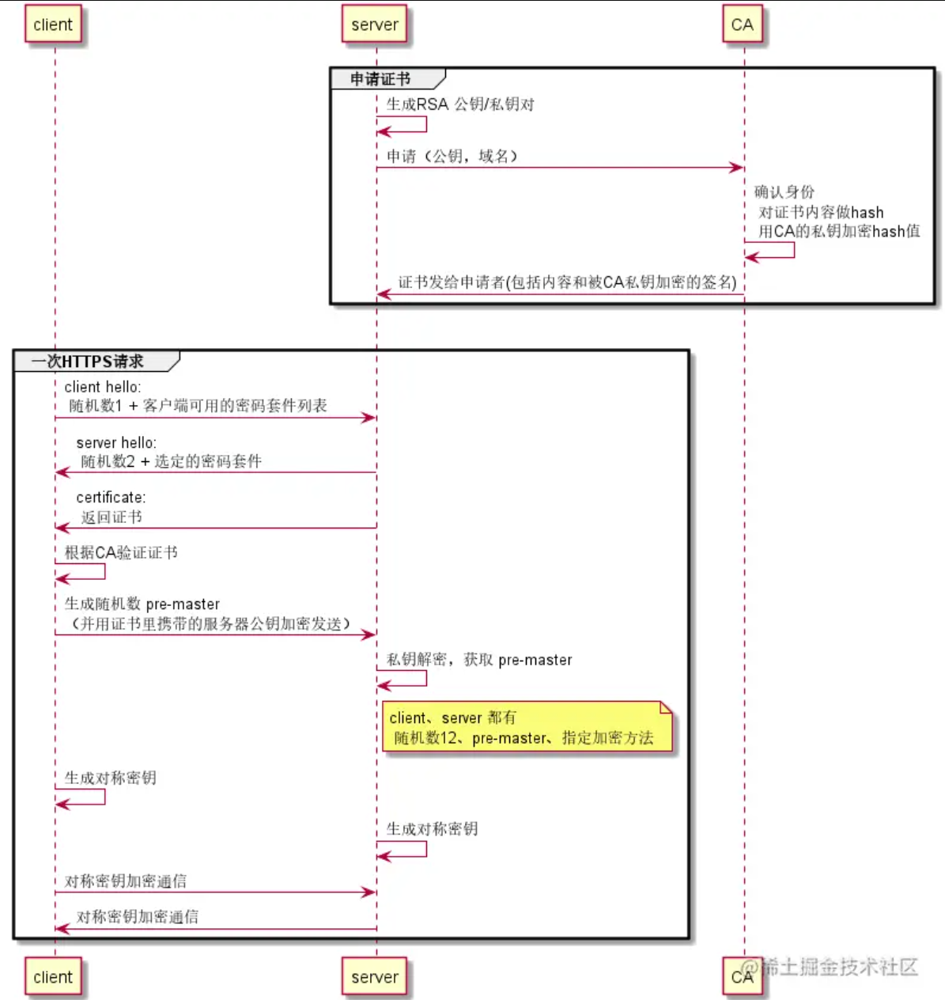

## HTTPS流程
参考：
* <https://juejin.cn/post/6863295544828444686>
* <https://segmentfault.com/a/1190000021494676>
* <https://juejin.cn/post/7033557989508251655>
* <https://www.cnblogs.com/814467783sweet/p/9647197.html>
* <https://www.zhihu.com/question/419830908>
* <https://zhuanlan.zhihu.com/p/434277576>
* <https://www.jianshu.com/p/6bf2f9a37feb>
* <https://stackoverflow.com/questions/26218396/how-does-the-browser-deal-with-missing-intermediate-certs>

HTTPS大致的流程是：
1. 客户端请求，服务器返回证书
2. 客户端验证证书（证书中包含服务器的公钥和验证用的签名）
3. 证书中包含了服务器公钥，客户端生成对称加密的密钥并通过服务器公钥加密传输给服务器(按图中的意思实际发送的是随机数，只是最终效果等价于发送了对称加密密钥)
4. 服务器用私钥解密得到对称加密密钥
5. 之后，双方发送的数据通过这个对称加密密钥进行加密传输

参考链接有两个图对HTTPS过程描述得比较明确：



## HTTPS为什么最终是证书 + 非对称加密 + 对称加密
以下所指的中间人具备掌控通信过程中一切节点的能力（包括掌控TCP流量和进行DNS劫持），不包括入侵客户端和服务端本身。也即范围是(客户端, 服务端)

HTTPS能做到防范中间人攻击的程度，中间人可以通过DNS劫持、控制中间路由器或运营商节点等方式成为双方通信过程中的一个节点，从而可以获取并操纵双方传输的数据。在这种情况下，HTTPS能保证双方传输数据的私密性，避免发生中间人能解密出传输的数据而客户端服务器无法感知的情况。

若只用对称加密，则将对称加密密钥进行安全传输就会有困难，容易受中间人攻击。不过，如果只有一对确定的客户端/服务端，只要提前在两端存好密钥就可以做到防中间人的程度（因为根本没有密钥需要通过网络传输）。

使用非对称加密。客户端请求服务器，服务器返回公钥，然后服务器用私钥，客户端用公钥通信如何？否，服务器的公钥是公开的，即便服务器每次特地为客户端生成新的公、私钥（会影响性能），告知客户端公钥时中间人也能获得公钥，从而服务器发给客户端的数据是能被中间人解密的。

补充：参考[这个](https://segmentfault.com/a/1190000021494676)："公钥与私钥是一对，如果用公钥对数据进行加密，只有用对应的私钥才能解密；如果用私钥对数据进行加密，那么只有用对应的公钥才能解密。"，也就是说，非对称加密的公钥私钥地位是相同的（不过看到有说具体的算法有可能公私钥长度会不一样，这种情况一般把长的作为私钥。还有可能有些非对称加密算法两个密钥本身地位就不一样），可以互相进行加解密，公私性来自于把哪个公开，哪个保密。

使用非对称加密 + 对称加密。客户端请求服务器，服务器返回公钥，然后客户端生成对称加密密钥，客户端使用服务器公钥加密这个对称加密密钥，传送给服务器，然后服务器用自己的私钥解密，然后后面的通信使用这个对称加密密钥进行加密传输。这种情况和认可服务器使用自签证书相同，客户端无法识别告知自己公钥/自签证书的人是中间人还是服务器，从而中间人可以在中间代理，既能获知双方传送的内容，也能让双方无感。

**但是，若此时能验证告知自己公钥的是真正的服务器，则可以确认，这个对称加密密钥只有客户端能知道，接下来也只有真正的服务器能通过服务器私钥解密知道。（除非中间人能控制客户端电脑获取到非对称加密密钥或者服务器私钥泄露或者中间人能控制服务器电脑获取到非对称加密密钥之类的）**

因此，需要使用证书 + 非对称加密 + 对称加密，证书需要具备认证机制，客户端需要能确认收到的服务器证书是可信的。从而要引入数字证书认证机构（CA，Certificate Authority）。

参考[这个](https://juejin.cn/post/6863295544828444686)链接中的内容：

---

**证书内容**

证书由服务方向CA机构申请，网站申请方需要自己先生成RSA密钥对，并将公钥和申请的域名等信息提交给CA。

CA审核通过后，给申请方返回证书，包括以下内容：

* 内容（部分）
    - 绑定域名
    - 服务的公钥
    - 有效期
    - 颁发机构
* 签名： 内容的hash值用CA的私钥进行加密

**客户端验证证书**

客户端获取服务端返回的证书后，根据证书里的摘要算法生成摘要，记为h1。还会使用CA的公钥解密证书的数字签名，得出h2。如果h1 === h2，则可以确认证书是由权威的CA机构签发的可信证书，如果再符合以下条件，就可以使用证书里的服务端RSA公钥进行下一步密钥协商了

* 时间未过期
* 域名匹配
* 不在 CRL（证书吊销列表）中

那么问题来了，CA的公钥要从哪里获取？如何保证这个公钥不被伪造可以信任呢？
答案很简单，将CA的证书写在操作系统和浏览器里（根证书），既然微软谷歌之类的机构信任它们，用户就可以认为它们是可信的。

---

服务器不需要把自己的私钥传给CA机构，生成签名是用CA机构的私钥。

预装的CA证书（根证书）是信任链的起点，根证书没有上层机构再为其本身作数字签名，所以都是自签证书。

## 为什么通过证书可以确认服务器是可信的
因为证书中含有用CA私钥加密的签名字段，可以CA公钥解密验证证书是否是由CA机构签发的。若证书验证通过，说明服务器受到了CA机构的审验，CA机构才签发证书，从而是可信的。

参考《HTTP权威指南》中的这张图：


从这张图可以看出，证书中的内容部分是明文的，客户端收到证书后，使用内容中指明的摘要算法计算hash1，再用CA机构的公钥解密签名，得到hash2，若两个hash值相同，则证书验证通过。

若是中间人自己的证书，即使将内容中的颁发机构写成权威机构，则使用权威机构的公钥解密出的hash2也会对不上hash1（由于CA机构私钥的保密性，中间人无法构造出能通过验证的签名），从而证书验证失败，能识别出风险并提示。

还有种情况是收到自签证书（非预装的根证书），自签证书本身能完成加密传输的功能，但是无法通过上层机构验证证书，也能识别出风险并提示。

证书验证通过，则说明CA机构验证了此证书申请人为域名所有者，**则这个证书里的公钥对应的私钥只有真正的服务器才知道**，从而保证传递的对称加密密钥的安全。（证书申请过程中会有域名验证，以证明域名为申请者所有，例如[阿里云证书申请](https://help.aliyun.com/document_detail/156645.html)就有手工DNS验证和文件验证两种域名验证方式，除非中间人把CA机构的DNS劫持了，否则CA机构能辨别出申请者是否为域名拥有者）

## 若中间人直接返回服务器证书给客户端会怎么样
这种情况下，客户端会验证通过，但是中间人由于没有服务器私钥，无法解密获得对称加密密钥。数据也是安全的。此时，中间人就算拿到传输数据也无法解析客户端的请求内容，也无法正确响应。

## 若中间人返回一个自己的域名的证书（找CA颁发的）会怎么样
客户端访问的域名和返回证书中的域名对不上，客户端能知道自己DNS被劫持了，证书验证失败。

## 客户端直接用ip地址访问https网址怎么办？
无法比对域名，无法发挥HTTPS的功能，试了下用一个https的网址url，url域名部分换成其ip(可以通过浏览器的Remote Address看到浏览器解析域名出来的ip地址)，浏览器会直接提示不安全。

## 客户端选择信任验证失败的证书（签名对不上或者自签证书无法验证）会怎么样
证书可能是中间人的，从而中间人能攻击成功，即：中间人能解密出传输的数据而客户端服务器无法感知。因此，服务器用自签证书是无法防止中间人攻击的。

## 中间人先劫持通信，然后返回自己找CA机构验证过的证书怎么样（证书里域名也对得上，完全能验证通过的那种）
能攻击成功。中间人无法自行构造出能通过验证的证书（因为不知道CA私钥），应该是以某种方式让CA机构错误地确认了这个域名为中间人所有。

## 可不可以用证书 + 非对称加密 + 非对称加密
由于服务器公钥的公开性，实际数据加密需要生成使用新的密钥，实际HTTPS采取的是客户端生成个对称加密密钥，不过实际上也可以客户端生成一对非对称加密密钥，实际数据加密通过这对非对称加密密钥进行。不这样做的原因应该是因为非对称密钥加解密开销大且没有必要。

## 证书和CA的引入为什么能有质变
证书验证通过，则说明CA机构验证了此证书申请人为域名所有者，**则这个证书里的公钥对应的私钥只有真正的服务器才知道**，从而保证传递的对称加密密钥的安全。（证书申请过程中会有域名验证，以证明域名为申请者所有，例如[阿里云证书申请](https://help.aliyun.com/document_detail/156645.html)就有手工DNS验证和文件验证两种域名验证方式，除非中间人把CA机构的DNS劫持了，否则CA机构能辨别出申请者是否为域名拥有者）

## 证书信任链
参考<https://juejin.cn/post/6863295544828444686>和<https://www.jianshu.com/p/6bf2f9a37feb>中的内容：

---

操作系统和浏览器里写入的CA证书称为根证书，但是根CA机构并不直接向网站提供证书签发服务，而是通过一级或多级的中间商来提供。

由根CA签发证书信任中间CA机构，中间CA机构再签发网站的证书，形成了根CA机构->中间CA->网站提供方这样的信任传递链条，称为证书链。

证书链里的证书一般分为三层。（也有更多层的，存在多级中间证书，但规则是一样的）


证书链验证过程为：
1. 客户端得到服务端返回的证书，通过读取得到服务端证书的发布机构。
2. 客户端去操作系统查找这个发布机构的的证书，如果是不是根证书就继续递归下去，直到拿到根证书。
3. 回溯。用根证书的公钥去解密验证前一层证书的合法性，再拿前一层证书的公钥去验证更前证书的合法性。
4. 最后验证服务器端的证书是可信任的。

---

关于中间证书是从哪里来的（因为只有根证书才会被预存），参考[这个](https://stackoverflow.com/questions/26218396/how-does-the-browser-deal-with-missing-intermediate-certs)里的回答内容: "look into the Authority Information Access section of the certificate and if they find the URL issuer certificate they will download the certificate to continue with the chain verification" (然后就可以cache中间证书了)

用浏览器查看掘金的证书链，可以找到证书内容中有颁发者证书地址


## 总结HTTPS关键点
1. 证书验证，确保证书中的服务器公钥对应的私钥只有真正的服务器知道。
2. 客户端生成对称加密密钥，通过服务器公钥加密传送，服务器用私钥解密。确保这个对称加密密钥只有客户端和服务器知道，从而数据是安全的。（除非中间人能控制客户端电脑获取到非对称加密密钥或者服务器私钥泄露或者中间人能控制服务器电脑获取到非对称加密密钥之类的）
3. 后续用对称加密密钥来传输数据。

中间人虽然无法解密HTTPS传输内容，不过向客户端/服务端乱发内容扰乱通信之类的还是可以做到的。

## 前向安全性
[这个链接](https://juejin.cn/post/6863295544828444686)提到了前向安全性的概念，挺有意思。链接中相关内容如下：
```
前向安全性指的是，如果有第三方收集了所有通信数据，当时它解不开，但很久之后如果私钥泄漏，能不能回过头来解密这些历史数据。

RSA的方式里，只要知道RSA私钥，就可以直接获取客户端加密传输的`pre-master`，进而计算出实际的对称加密密钥，该方法是非前向安全的。

而在DH算法中，RSA密钥对只是用于做数字签名，用于生成`pre-master`的关键参数`客户端DH私钥`和`服务端DH私钥`都没有经过网络传输，即使RSA私钥泄漏也无法解密历史数据，是 前向安全的。

注：DH算法其实还分为静态DH和临时DH(DHE)两种。静态DH中，服务端的DH参数和DH公钥是固定保存在证书里的，也不能保证前向安全性，该方式已经被OpenSSL废弃。上文描述的其实是DHE算法。
```